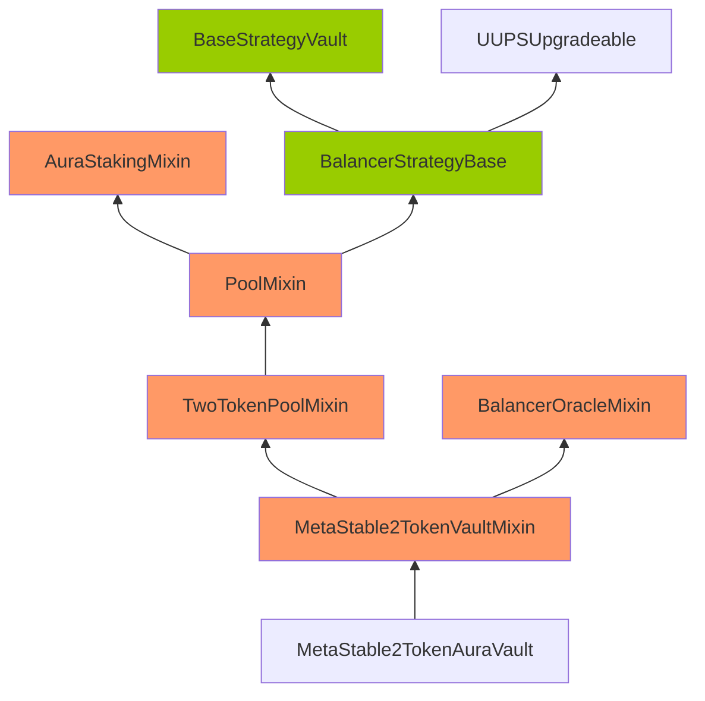
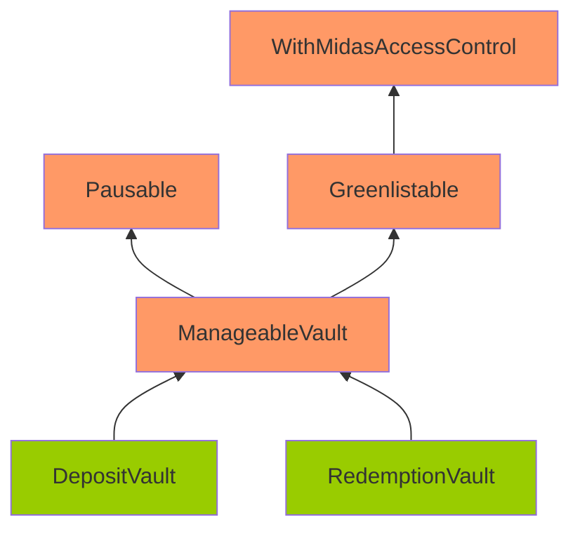
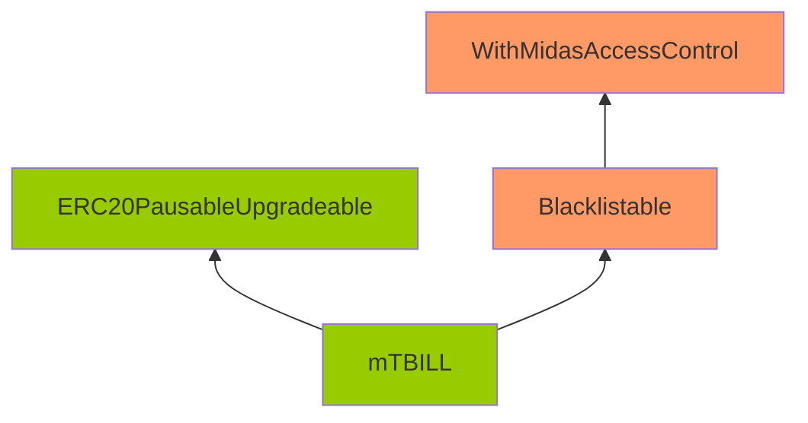

# Upgrade & Storage Security Patterns (Consolidated)

> **Upgradeable contracts are powerful but dangerous. Storage collision = instant loss.**

---

## Quick Summary

| Issue | Description | Severity |
|-------|-------------|----------|
| Storage Collision | Proxy and impl storage slots overlap | Critical |
| Uninitialized Proxy | initialize() never called | Critical |
| Front-Run Initialize | Attacker initializes before owner | Critical |
| Missing Storage Gap | No __gap for future upgrades | High |
| Selfdestruct in Impl | Implementation can be destroyed | Critical |
| Immutable in Proxy | Immutables don't work in proxies | High |

---

## Detection Strategy

### Storage Collision
```solidity
// VULNERABLE: Both use slot 0
contract Proxy {
    address implementation;  // slot 0
}
contract Implementation {
    address owner;  // slot 0 - COLLISION!
}

// SAFE: Use EIP-1967 storage slots
bytes32 constant IMPL_SLOT = bytes32(uint256(keccak256("eip1967.proxy.implementation")) - 1);
```

### Initialize Protection
```solidity
// VULNERABLE: Can be called multiple times
function initialize(address _owner) external {
    owner = _owner;
}

// SAFE: Use initializer modifier
import "@openzeppelin/contracts-upgradeable/proxy/utils/Initializable.sol";
function initialize(address _owner) external initializer {
    require(_owner != address(0), "Zero address");
    owner = _owner;
}
```

### Storage Gap
```solidity
// For upgradeable base contracts
abstract contract BaseContract {
    uint256 public value;
    
    // Reserve 50 slots for future variables
    uint256[49] private __gap;
}
```

### Audit Checklist
- [ ] Using EIP-1967 storage slots for proxy state
- [ ] initialize() has initializer modifier
- [ ] initialize() checks for zero addresses
- [ ] All upgradeable base contracts have __gap
- [ ] No selfdestruct in implementation
- [ ] No immutable variables in upgradeable contracts
- [ ] Constructor only sets immutables or disables initializers
- [ ] Storage layout preserved between upgrades

---

## Proxy Patterns Reference

| Pattern | Pros | Cons |
|---------|------|------|
| Transparent Proxy | Simple, widely used | Gas overhead on every call |
| UUPS | Gas efficient | Risk if upgrade function broken |
| Beacon Proxy | Upgrade many proxies at once | More complex |
| Diamond (EIP-2535) | Modular, no size limit | Very complex |

---

## Included Pattern Files

- upgradable-patterns.md, initialization-patterns.md, initializer-patterns.md
- storage-collision-patterns.md, storage-gap-patterns.md
- immutable-patterns.md, hardcoded-address-patterns.md, hardcoded-setting-patterns.md
- configuration-patterns.md

---

## Full Pattern Details

---
## upgradable-patterns.md
# Upgradable Security Patterns

## Overview

**Frequency**: 10 occurrences (0.02% of all findings)

**Severity Distribution**:
| Critical | High | Medium | Low | Gas |
|----------|------|--------|-----|-----|
| 0 | 2 | 6 | 2 | 0 |

**Common Sources**: Code4rena, Sherlock, Cyfrin

---

## Detection Checklist

- [ ] Check for upgradable vulnerabilities in all external functions
- [ ] Verify proper validation and access controls
- [ ] Review state changes and their ordering
- [ ] Analyze edge cases and boundary conditions
- [ ] Test with malicious inputs and sequences

---

## Real-World Examples

### Example 1: [H-01] Usage of an incorrect version of Ownbale library can potentially malfunction all onlyOwner functions

**Source**: Code4rena
**Protocol**: Covalent
**Impact**: HIGH

**Details**:

## Handle

WatchPug


## Vulnerability details

https://github.com/code-423n4/2021-10-covalent/blob/ded3aeb2476da553e8bb1fe43358b73334434737/contracts/DelegatedStaking.sol#L62-L63

```solidity
// this is used to have the contract upgradeable
function initialize(uint128 minStakedRequired) public initializer {
```

Based on the context and comments in the code, the `DelegatedStaking.sol` contract is designed to be deployed as an upgradeable proxy contract.

However, the current implementaion is using an non-upgradeable version of the `Ownbale` library: `@openzeppelin/contracts/access/Ownable.sol` instead of the upgradeable version: `@openzeppelin/contracts-upgradeable/access/OwnableUpgradeable.sol`.

A regular, non-upgradeable `Ownbale` library will make the deployer the default owner in the constructor. Due to a requirement of the proxy-based upgradeability system, no constructors can be used in upgradeable contracts. Therefore, there will be no owner when the contract is deployed as a proxy contract.

As a result, all the `onlyOwner` functions will be inaccessible.

### Recommendation

Use `@openzeppelin/contracts-upgradeable/access/OwnableUpgradeable.sol` and `@openzeppelin/contracts-upgradeable/proxy/utils/Initializable.sol` instead.

And change the `initialize()` function to:

```solidity
function initialize(uint128 minStakedRequired) public initializer {
    __Ownable_init();
    ...
}
```

**Reference**: [View Original Finding](https://code4rena.com/reports/2021-10-covalent)

---

### Example 2: [H-04] The Constructor Caveat leads to bricking of Configurator contract.

**Source**: Code4rena
**Protocol**: Lybra Finance
**Impact**: HIGH

**Details**:

In Solidity, code that is inside a constructor or part of a global variable declaration is not part of a deployed contract's runtime bytecode. This code is executed only once, when the contract instance is deployed. As a consequence of this, the code within a logic contract's constructor will never be executed in the context of the proxy's state. This means that any state changes made in the constructor of a logic contract will not be reflected in the proxy's state.
1.  This will lead to governance timelocks contract and the `curvePool` contract contain default values of zero values.
2.  As a result, all the functions that rely on governance will be broken, since the governance address is set to zero address.

### Proof of Concept

```
// SPDX-License-Identifier: UNLICENSED
pragma solidity ^0.8.13;

import "forge-std/Test.sol";
import {ITransparentUpgradeableProxy} from "@openzeppelin/contracts/proxy/transparent/TransparentUpgradeableProxy.sol";

import {LybraProxy} from "@lybra/Proxy/LybraProxy.sol";
import {LybraProxyAdmin} from "@lybra/Proxy/LybraProxyAdmin.sol";
import {GovernanceTimelock} from "@lybra/governance/GovernanceTimelock.sol";
import {PeUSDMainnet} from "@lybra/token/PeUSDMainnetStableVision.sol";
import {Configurator} from "@lybra/configuration/LybraConfigurator.sol";
import {EUSDMock} from "@mocks/mockEUSD.sol";
import {mockCurve} from "@mocks/mockCurve.sol";
import {mockUSDC} from "@mocks/mockUSDC.sol";

/* remappings used
@lybra=contracts/lybra/
@mocks=cont

*[Content truncated...]*

**Reference**: [View Original Finding](https://code4rena.com/reports/2023-06-lybra)

---

### Example 3: [M-07] No Storage Gap for Upgradeable Contracts

**Source**: Code4rena
**Protocol**: Rubicon
**Impact**: MEDIUM

**Details**:

_Submitted by 0x1337, also found by broccolirob_

<https://github.com/code-423n4/2022-05-rubicon/blob/8c312a63a91193c6a192a9aab44ff980fbfd7741/contracts/RubiconMarket.sol#L448-L449>

<https://github.com/code-423n4/2022-05-rubicon/blob/8c312a63a91193c6a192a9aab44ff980fbfd7741/contracts/RubiconMarket.sol#L525-L535>

### Impact

For upgradeable contracts, there must be storage gap to "allow developers to freely add new state variables in the future without compromising the storage compatibility with existing deployments". Otherwise it may be very difficult to write new implementation code. Without storage gap, the variable in child contract might be overwritten by the upgraded base contract if new variables are added to the base contract. This could have unintended and very serious consequences to the child contracts.

Refer to the bottom part of this article: <https://docs.openzeppelin.com/upgrades-plugins/1.x/writing-upgradeable>

### Proof of Concept

As an example, the `ExpiringMarket` contract inherits `SimpleMarket`, and the `SimpleMarket` contract does not contain any storage gap. If in a future upgrade, an additional variable is added to the `SimpleMarket` contract, that new variable will overwrite the storage slot of the `stopped` variable in the `ExpiringMarket` contract, causing unintended consequences.

<https://github.com/code-423n4/2022-05-rubicon/blob/8c312a63a91193c6a192a9aab44ff980fbfd7741/contracts/RubiconMarket.sol#L448-L449>

Similarly, the `ExpiringMarket` d

*[Content truncated...]*

**Reference**: [View Original Finding](https://code4rena.com/reports/2022-05-rubicon)

---

### Example 4: M-16: Corruptible Upgradability Pattern

**Source**: Sherlock
**Protocol**: Notional
**Impact**: MEDIUM

**Details**:

Source: https://github.com/sherlock-audit/2022-09-notional-judging/issues/64 

## Found by 
xiaoming90, supernova

## Summary

Storage of Boosted3TokenAuraVault and MetaStable2TokenAuraVault vaults might be corrupted during an upgrade.

## Vulnerability Detail

Following are the inheritance of the Boosted3TokenAuraVault and MetaStable2TokenAuraVault vaults.

Note: The contracts highlighted in Orange mean that there are no gap slots defined. The contracts highlighted in Green mean that gap slots have been defined

**Inheritance of the MetaStable2TokenAuraVault vault**




**Inheritance of the Boosted3TokenAuraVault vault**

```mermaid
graph BT;
	classDef nogap fill:#f96;
	classDef hasgap fill:#99cc00;
    Boosted3TokenAuraVault-->Boosted3TokenPoolMixin:::nogap
    Boosted3TokenPoolMixin:::nogap-->PoolMixin:::nogap
    PoolMixin:::nogap-->BalancerStrategyBase
    PoolMixin:::nogap-->AuraStakingMixin:::nogap
    BalancerStrategyBase:::hasgap--

*[Content truncated...]*

---

### Example 5: M-15: `CrossCurrencyfCashVault` Cannot Be Upgraded

**Source**: Sherlock
**Protocol**: Notional
**Impact**: MEDIUM

**Details**:

Source: https://github.com/sherlock-audit/2022-09-notional-judging/issues/65 

## Found by 
xiaoming90

## Summary

`CrossCurrencyfCashVault` cannot be upgraded as it is missing the authorize upgrade method.

## Vulnerability Detail

The Cross Currency Vault is expected to be upgradeable as:

- This vault is similar to the other vaults (Boosted3TokenAuraVault and MetaStable2TokenAuraVault) provided by Notional that are upgradeable by default.
- The `BaseStrategyVault` has configured the storage gaps `uint256[45] private __gap` for upgrading purposes
- Clarified with the sponsor and noted that Cross Currency Vault should be upgradeable

`CrossCurrencyfCashVault` inherits from `BaseStrategyVault`.  However, the `BaseStrategyVault` forget to inherit Openzepplin's `UUPSUpgradeable` contract. Therefore, it is missing the authorize upgrade method, and the contract cannot be upgraded.

https://github.com/sherlock-audit/2022-09-notional/blob/main/leveraged-vaults/contracts/vaults/BaseStrategyVault.sol#L14

```solidity
abstract contract BaseStrategyVault is Initializable, IStrategyVault {
    using TokenUtils for IERC20;
    using TradeHandler for Trade;

    /// @notice Hardcoded on the implementation contract during deployment
    NotionalProxy public immutable NOTIONAL;
    ITradingModule public immutable TRADING_MODULE;
    uint8 constant internal INTERNAL_TOKEN_DECIMALS = 8;
    
    ..SNIP..
    
    // Storage gap for future potential upgrades
    uint256[45] private __gap;
 }


*[Content truncated...]*

---

### Example 6: [M-04] Pool designed to be upgradeable but does not set owner, making it un-upgradeable

**Source**: Code4rena
**Protocol**: Blur Exchange
**Impact**: MEDIUM

**Details**:

The docs state:<br>
"*The pool allows user to predeposit ETH so that it can be used when a seller takes their bid. It uses an ERC1967 proxy pattern and only the exchange contract is permitted to make transfers.*"

Pool is designed as an ERC1967 upgradeable proxy which handles balances of users in Not Fungible. Users may interact via deposit and withdraw with the pool, and use the funds in it to pay for orders in the Exchange.

Pool is declared like so:
```
contract Pool is IPool, OwnableUpgradeable, UUPSUpgradeable {
	function _authorizeUpgrade(address) internal override onlyOwner {}
	...
```

Importantly, it has no constructor and no initializers. The issue is that when using upgradeable contracts, it is important to implement an initializer which will call the base contract's initializers in turn. See how this is done correctly in Exchange.sol:

```
/* Constructor (for ERC1967) */
function initialize(
		IExecutionDelegate _executionDelegate,
		IPolicyManager _policyManager,
		address _oracle,
		uint _blockRange
) external initializer {
		__Ownable_init();
		isOpen = 1;
		...
}
```

Since Pool skips the \_\_Ownable_init initialization call, this logic is skipped:
```
function __Ownable_init() internal onlyInitializing {
		__Ownable_init_unchained();
}
function __Ownable_init_unchained() internal onlyInitializing {
		_transferOwnership(_msgSender());
}
```

Therefore, the contract owner stays zero initialized, and this means any use of onlyOwner will always revert.

The only 

*[Content truncated...]*

**Reference**: [View Original Finding](https://code4rena.com/reports/2022-11-non-fungible)

---

### Example 7: [M-21] Truncation in casting can lead to a founder receiving all the base tokens

**Source**: Code4rena
**Protocol**: Nouns Builder
**Impact**: MEDIUM

**Details**:

<https://github.com/code-423n4/2022-09-nouns-builder/blob/7e9fddbbacdd7d7812e912a369cfd862ee67dc03/src/token/Token.sol#L71-L126><br>
<https://github.com/code-423n4/2022-09-nouns-builder/blob/7e9fddbbacdd7d7812e912a369cfd862ee67dc03/src/token/Token.sol#L88>

The initialize function of the `Token` contract receives an array of `FounderParams`, which contains the ownership percent of each founder as a `uint256`. The initialize function checks that the sum of the percents is not more than 100, but the value that is added to the sum of the percent is truncated to fit in `uint8`. This leads to an error because the value that is used for assigning the base tokens is the original, not truncated, `uint256` value.

This can lead to wrong assignment of the base tokens, and can also lead to a situation where not all the users will get the correct share of base tokens (if any).

### Proof of Concept

To verify this bug I created a foundry test. You can add it to the test folder and run it with `forge test --match-test testFounderGettingAllBaseTokensBug`.

This test deploys a token implementation and an `ERC1967` proxy that points to it, and initializes the proxy using an array of 2 founders, each having 256 ownership percent. The value which is added to the `totalOwnership` variable is a `uint8`, and when truncating 256 to fit in a `uint8` it will turn to 0, so this check will pass.

After the call to initialize, the test asserts that all the base token ids belongs to the first founder, w

*[Content truncated...]*

**Reference**: [View Original Finding](https://code4rena.com/reports/2022-09-nouns-builder)

---

### Example 8: M-1: Corruptible Upgradability Pattern

**Source**: Sherlock
**Protocol**: Midas
**Impact**: MEDIUM

**Details**:

Source: https://github.com/sherlock-audit/2024-05-midas-judging/issues/109 

## Found by 
0xb0k0, 0xjarix, Kalogerone, PNS, ZdravkoHr., charles\_\_cheerful, meltedblocks, nfmelendez, pkqs90, tpiliposian, yovchev\_yoan

## Summary

Storage of DepositVault/RedemptionVault/mTBILL contracts might be corrupted during an upgrade.

## Vulnerability Detail

Following are the inheritance of the DepositVault/RedemptionVault/mTBILL contracts.

Note: The contracts highlighted in Orange mean that there are no gap slots defined. The contracts highlighted in Green mean that gap slots have been defined





The DepositVault/RedemptionVault/mTBILL contracts are meant to be upgradeable. However, it inherits contracts that are not upgrade-safe.

The gap storage has been implemented on the DepositVault/RedemptionVault/mTBILL/ERC20PausableUpgradeable.

However, no gap storage is implemented on ManageableVaul

*[Content truncated...]*

---

### Example 9: [L-03] Contracts are not using their OZ upgradeable counterparts

**Source**: Code4rena
**Protocol**: JPYC
**Impact**: LOW

**Details**:

### Tools Used

Diffchecker

### Description

The non-upgradeable standard version of OpenZeppelins library, such as `Ownable`, `Pausable`, `Address`, `Context`, `SafeERC20`, `ERC1967Upgrade` etc, are inherited / used by both the proxy and the implementation contracts.

As a result, when attempting to use the upgrades plugin mentioned, the following errors are raised:

```solidity
Error: Contract `FiatTokenV1` is not upgrade safe

contracts/v1/FiatTokenV1.sol:58: Variable `totalSupply_` is assigned an initial value
  Move the assignment to the initializer
  https://zpl.in/upgrades/error-004

contracts/v1/Pausable.sol:49: Variable `paused` is assigned an initial value
  Move the assignment to the initializer
  https://zpl.in/upgrades/error-004

contracts/v1/Ownable.sol:28: Contract `Ownable` has a constructor
  Define an initializer instead
  https://zpl.in/upgrades/error-001

contracts/util/Address.sol:186: Use of delegatecall is not allowed
  https://zpl.in/upgrades/error-002
```

Having reviewed these errors, none had any adversarial impact:

*   `totalSupply_` and `paused` are explictly assigned the default values `0` and `false`
*   the implementation contracts utilises the internal `_transferOwnership()` in the initializer, thus transferring ownership to `newOwner` regardless of who the current owner is
*   `Address`'s `delegatecall` is only used by the `ERC1967Upgrade` contract. Comparing both the `Address` and `ERC1967Upgrade` contracts against their upgradeable count

*[Content truncated...]*

**Reference**: [View Original Finding](https://code4rena.com/reports/2022-02-jpyc)

---

### Example 10: Upgradeable contracts which are inherited from should use ERC7201 namespaced storage layouts or storage gaps to prevent storage collision

**Source**: Cyfrin
**Protocol**: Strata
**Impact**: LOW

**Details**:

**Description:** The protocol has upgradeable contracts which other contracts inherit from. These contracts should either use:
* [ERC7201](https://eips.ethereum.org/EIPS/eip-7201) namespaced storage layouts - [example](https://github.com/OpenZeppelin/openzeppelin-contracts-upgradeable/blob/master/contracts/access/AccessControlUpgradeable.sol#L60-L72)
* storage gaps (though this is an [older and no longer preferred](https://blog.openzeppelin.com/introducing-openzeppelin-contracts-5.0#Namespaced) method)

The ideal mitigation is that all upgradeable contracts use ERC7201 namespaced storage layouts.

Without using one of the above two techniques storage collision can occur during upgrades.

**Strata:** Fixed in commit [98068bd](https://github.com/Strata-Money/contracts/commit/98068bd9d9d435b37ce8f855f45b61d37aa274db).

**Cyfrin:** Verified.

**Reference**: [View Original Finding](https://github.com/solodit/solodit_content/blob/main/reports/Cyfrin/2025-06-11-cyfrin-strata-v2.1.md)

---

## Statistics

- Total findings analyzed: 10
- Examples shown: 10
- Data source: Cyfrin Solodit (50,530 total findings)
- Last updated: 2026-01-29


---
## initialization-patterns.md
# Initialization Security Patterns

## Overview

**Frequency**: 15 occurrences (0.03% of all findings)

**Severity Distribution**:
| Critical | High | Medium | Low | Gas |
|----------|------|--------|-----|-----|
| 0 | 5 | 10 | 0 | 0 |

**Common Sources**: Code4rena, Sherlock, Spearbit, Codehawks, ConsenSys

---

## Detection Checklist

- [ ] Check for initialization vulnerabilities in all external functions
- [ ] Verify proper validation and access controls
- [ ] Review state changes and their ordering
- [ ] Analyze edge cases and boundary conditions
- [ ] Test with malicious inputs and sequences

---

## Real-World Examples

### Example 1: Unauthorized access to change acceptanceDelay

**Source**: Spearbit
**Protocol**: Connext
**Impact**: HIGH

**Details**:

## Vulnerability Report

## Severity
**High Risk**

## Context
**File:** DiamondInit.sol  
**Lines:** 35-L40

## Description
The `acceptanceDelay` along with `supportedInterfaces[]` can be set by any user without the need of any Authorization once the init function of `DiamondInit` has been called and set. This is happening since caller checks (`LibDiamond.enforceIsContractOwner();`) are missing for these fields. 

Since `acceptanceDelay` defines the time post which certain action could be executed, setting a very large value could cause a Denial of Service (DOS) to the system (the new owner cannot be set) and setting a very low value could allow changes to be made without consideration time (such as Setting/Renouncing Admin, Disabling whitelisting etc. at `ProposedOwnableFacet.sol`).

## Recommendation
Change the function implementation as shown below:

```solidity
LibDiamond.DiamondStorage storage ds = LibDiamond.diamondStorage();
// Current implementation
- ds.supportedInterfaces[type(IERC165).interfaceId] = true;
- ds.supportedInterfaces[type(IDiamondCut).interfaceId] = true;
- ds.supportedInterfaces[type(IDiamondLoupe).interfaceId] = true;
- ds.supportedInterfaces[type(IProposedOwnable).interfaceId] = true;
- ds.acceptanceDelay = _acceptanceDelay;

if (!s.initialized) {
    ...
    // Proposed implementation
    + ds.supportedInterfaces[type(IERC165).interfaceId] = true;
    + ds.supportedInterfaces[type(IDiamondCut).interfaceId] = true;
    + ds.supportedInterfaces[type

*[Content truncated...]*

**Reference**: [View Original Finding](https://github.com/spearbit/portfolio/blob/master/pdfs/ConnextNxtp-Spearbit-Security-Review.pdf)

---

### Example 2: [H-01] Minter.sol#startInflation() can be bypassed.

**Source**: Code4rena
**Protocol**: Backd
**Impact**: HIGH

**Details**:

## Lines of code

https://github.com/code-423n4/2022-05-backd/blob/2a5664d35cde5b036074edef3c1369b984d10010/protocol/contracts/tokenomics/Minter.sol#L104-L108


## Vulnerability details

https://github.com/code-423n4/2022-05-backd/blob/2a5664d35cde5b036074edef3c1369b984d10010/protocol/contracts/tokenomics/Minter.sol#L104-L108

```solidity
    function startInflation() external override onlyGovernance {
        require(lastEvent == 0, "Inflation has already started.");
        lastEvent = block.timestamp;
        lastInflationDecay = block.timestamp;
    }
```

As `lastEvent` and `lastInflationDecay` are not initialized in the `constructor()`, they will remain to the default value of `0`.

However, the permissionless `executeInflationRateUpdate()` method does not check the value of `lastEvent` and `lastInflationDecay` and used them directly.

As a result, if `executeInflationRateUpdate()` is called before `startInflation()`:

1. L190, the check of if `_INFLATION_DECAY_PERIOD` has passed since `lastInflationDecay` will be `true`, and `initialPeriodEnded` will be set to `true` right away;
2. L188, since the `lastEvent` in `totalAvailableToNow += (currentTotalInflation * (block.timestamp - lastEvent));` is `0`, the `totalAvailableToNow` will be set to `totalAvailableToNow  currentTotalInflation * 52 years`, which renders the constrains of `totalAvailableToNow` incorrect and useless.

https://github.com/code-423n4/2022-05-backd/blob/2a5664d35cde5b036074edef3c1369b984d10010/protoc

*[Content truncated...]*

**Reference**: [View Original Finding](https://code4rena.com/reports/2022-05-backd)

---

### Example 3: [H-04] Initial pool deposit can be stolen

**Source**: Code4rena
**Protocol**: InsureDAO
**Impact**: HIGH

**Details**:

_Submitted by cmichel, also found by WatchPug_

Note that the `PoolTemplate.initialize` function, called when creating a market with `Factory.createMarket`, calls a vault function to transfer an initial deposit amount (`conditions[1]`) *from* the initial depositor (`_references[4]`):

```solidity
// PoolTemplate
function initialize(
     string calldata _metaData,
     uint256[] calldata _conditions,
     address[] calldata _references
) external override {
     // ...

     if (_conditions[1] > 0) {
          // @audit vault calls asset.transferFrom(_references[4], vault, _conditions[1])
          _depositFrom(_conditions[1], _references[4]);
     }
}

function _depositFrom(uint256 _amount, address _from)
     internal
     returns (uint256 _mintAmount)
{
     require(
          marketStatus == MarketStatus.Trading && paused == false,
          "ERROR: DEPOSIT_DISABLED"
     );
     require(_amount > 0, "ERROR: DEPOSIT_ZERO");

     _mintAmount = worth(_amount);
     // @audit vault calls asset.transferFrom(_from, vault, _amount)
     vault.addValue(_amount, _from, address(this));

     emit Deposit(_from, _amount, _mintAmount);

     //mint iToken
     _mint(_from, _mintAmount);
}
```

The initial depositor needs to first approve the vault contract for the `transferFrom` to succeed.

An attacker can then frontrun the `Factory.createMarket` transaction with their own market creation (it does not have access restrictions) and create a market *with different parameters* but st

*[Content truncated...]*

**Reference**: [View Original Finding](https://code4rena.com/reports/2022-01-insure)

---

### Example 4: [H-04] The Constructor Caveat leads to bricking of Configurator contract.

**Source**: Code4rena
**Protocol**: Lybra Finance
**Impact**: HIGH

**Details**:

In Solidity, code that is inside a constructor or part of a global variable declaration is not part of a deployed contract's runtime bytecode. This code is executed only once, when the contract instance is deployed. As a consequence of this, the code within a logic contract's constructor will never be executed in the context of the proxy's state. This means that any state changes made in the constructor of a logic contract will not be reflected in the proxy's state.
1.  This will lead to governance timelocks contract and the `curvePool` contract contain default values of zero values.
2.  As a result, all the functions that rely on governance will be broken, since the governance address is set to zero address.

### Proof of Concept

```
// SPDX-License-Identifier: UNLICENSED
pragma solidity ^0.8.13;

import "forge-std/Test.sol";
import {ITransparentUpgradeableProxy} from "@openzeppelin/contracts/proxy/transparent/TransparentUpgradeableProxy.sol";

import {LybraProxy} from "@lybra/Proxy/LybraProxy.sol";
import {LybraProxyAdmin} from "@lybra/Proxy/LybraProxyAdmin.sol";
import {GovernanceTimelock} from "@lybra/governance/GovernanceTimelock.sol";
import {PeUSDMainnet} from "@lybra/token/PeUSDMainnetStableVision.sol";
import {Configurator} from "@lybra/configuration/LybraConfigurator.sol";
import {EUSDMock} from "@mocks/mockEUSD.sol";
import {mockCurve} from "@mocks/mockCurve.sol";
import {mockUSDC} from "@mocks/mockUSDC.sol";

/* remappings used
@lybra=contracts/lybra/
@mocks=cont

*[Content truncated...]*

**Reference**: [View Original Finding](https://code4rena.com/reports/2023-06-lybra)

---

### Example 5: Initialization functions can be front-run

**Source**: TrailOfBits
**Protocol**: Advanced Blockchain
**Impact**: HIGH

**Details**:

## Type: Timing

## Difficulty: Medium

### Target: Throughout the contracts

### Description
The `CrosslayerPortal` contracts have initializer functions that can be front-run, allowing an attacker to incorrectly initialize the contracts. Due to the use of the `delegatecall` proxy pattern, these contracts cannot be initialized with their own constructors, and they have initializer functions:

```solidity
function initialize() public initializer {
    __Ownable_init();
    __Pausable_init();
    __ReentrancyGuard_init();
}
```

*Figure 1.1: The `initialize` function in `MsgSender:126-130`*

An attacker could front-run these functions and initialize the contracts with malicious values. This issue affects the following system contracts:

- `contracts/core/BridgeAggregator`
- `contracts/core/InvestmentStrategyBase`
- `contracts/core/MosaicHolding`
- `contracts/core/MosaicVault`
- `contracts/core/MosaicVaultConfig`
- `contracts/core/functionCalls/MsgReceiverFactory`
- `contracts/core/functionCalls/MsgSender`
- `contracts/nfts/Summoner`
- `contracts/protocols/aave/AaveInvestmentStrategy`
- `contracts/protocols/balancer/BalancerV1Wrapper`
- `contracts/protocols/balancer/BalancerVaultV2Wrapper`
- `contracts/protocols/bancor/BancorWrapper`
- `contracts/protocols/compound/CompoundInvestmentStrategy`
- `contracts/protocols/curve/CurveWrapper`
- `contracts/protocols/gmx/GmxWrapper`
- `contracts/protocols/sushiswap/SushiswapLiquidityProvider`
- `contracts/protocols/synapse/ISynapseSwap`
-

*[Content truncated...]*

**Reference**: [View Original Finding](https://github.com/trailofbits/publications/blob/master/reviews/AdvancedBlockchain.pdf)

---

### Example 6: [M-01] `PirexGmx.initiateMigration` can be blocked

**Source**: Code4rena
**Protocol**: Redacted Cartel
**Impact**: MEDIUM

**Details**:

`PirexGmx.initiateMigration` can be blocked so contract will not be able to migrate his funds to another contract using gmx.

### Proof of Concept

PirexGmx was designed with the thought that the current contract can be changed with another during migration.

`PirexGmx.initiateMigration` is the first point in this long process.

<https://github.com/code-423n4/2022-11-redactedcartel/blob/main/src/PirexGmx.sol#L921-L935>

```solidity
    function initiateMigration(address newContract)
        external
        whenPaused
        onlyOwner
    {
        if (newContract == address(0)) revert ZeroAddress();


        // Notify the reward router that the current/old contract is going to perform
        // full account transfer to the specified new contract
        gmxRewardRouterV2.signalTransfer(newContract);


        migratedTo = newContract;


        emit InitiateMigration(newContract);
    }
```

As you can see `gmxRewardRouterV2.signalTransfer(newContract);` is called to start migration.

This is the code of signalTransfer function
<https://arbiscan.io/address/0xA906F338CB21815cBc4Bc87ace9e68c87eF8d8F1#code#F1#L282>

```solidity
    function signalTransfer(address _receiver) external nonReentrant {
        require(IERC20(gmxVester).balanceOf(msg.sender) == 0, "RewardRouter: sender has vested tokens");
        require(IERC20(glpVester).balanceOf(msg.sender) == 0, "RewardRouter: sender has vested tokens");

        _validateReceiver(_receiver);
        pendingReceivers[msg.send

*[Content truncated...]*

**Reference**: [View Original Finding](https://code4rena.com/reports/2022-11-redactedcartel)

---

### Example 7: [M-10] Wrong DOMAIN_SEPARATOR

**Source**: Code4rena
**Protocol**: Rubicon
**Impact**: MEDIUM

**Details**:

_Submitted by 0x1f8b, also found by rotcivegaf, unforgiven, CertoraInc, eccentricexit, and IllIllI_

The `DOMAIN_SEPARATOR` is wrongly calculated.

### Proof of Concept

In the `initialize` method of the `BathToken` contract, the `name` of the contract is used to calculate the `DOMAIN_SEPARATOR`, however said name is set later, so it will use an incorrect `name`, making it impossible to calculate the `DOMAIN_SEPARATOR` correctly.

```javascript
DOMAIN_SEPARATOR = keccak256(
    abi.encode(
        keccak256(
            "EIP712Domain(string name,string version,uint256 chainId,address verifyingContract)"
        ),
        keccak256(bytes(name)),
        keccak256(bytes("1")),
        chainId,
        address(this)
    )
);
name = string(abi.encodePacked(_symbol, (" v1")));
```

Affected source code:

*   [BathToken.sol#L199-L210](https://github.com/code-423n4/2022-05-rubicon/blob/521d50b22b41b1f52ff9a67ea68ed8012c618da9/contracts/rubiconPools/BathToken.sol#L199-L210)

### Recommended Mitigation Steps

*   Set the `name` before using it.

**[bghughes (Rubicon) confirmed](https://github.com/code-423n4/2022-05-rubicon-findings/issues/38)**


***

**Reference**: [View Original Finding](https://code4rena.com/reports/2022-05-rubicon)

---

### Example 8: [M-01] Multiples initializations of `JBTiered721Delegate`

**Source**: Code4rena
**Protocol**: Juicebox
**Impact**: MEDIUM

**Details**:

The `initialize` method of the `JBTiered721Delegate` contract has as a flag that the `_store` argument is different from `address(0)`, however, it can be initialized by anyone with this value to allow the project to continue with its usual initialization, the attacker could have interfered and modified the corresponding values to carry out an attack.

### Proof of Concept

Looking at the method below, we highlight in green the parts that need to be initialized to prevent a call to `store=address(0)` from failing.

```diff
  function initialize(
    uint256 _projectId,
    IJBDirectory _directory,
    string memory _name,
    string memory _symbol,
    IJBFundingCycleStore _fundingCycleStore,
    string memory _baseUri,
    IJBTokenUriResolver _tokenUriResolver,
    string memory _contractUri,
    JB721PricingParams memory _pricing,
    IJBTiered721DelegateStore _store,
    JBTiered721Flags memory _flags
  ) public override {
    // Make the original un-initializable.
    require(address(this) != codeOrigin);
    // Stop re-initialization.
    require(address(store) == address(0));

    // Initialize the sub class.
    JB721Delegate._initialize(_projectId, _directory, _name, _symbol);

    fundingCycleStore = _fundingCycleStore;
    store = _store;
    pricingCurrency = _pricing.currency;
    pricingDecimals = _pricing.decimals;
    prices = _pricing.prices;

    // Store the base URI if provided.
+   if (bytes(_baseUri).length != 0) _store.recordSetBaseUri(_baseUri);

    // 

*[Content truncated...]*

**Reference**: [View Original Finding](https://code4rena.com/reports/2022-10-juicebox)

---

### Example 9: No Protection of Uninitialized Implementation Contracts From Attacker

**Source**: ConsenSys
**Protocol**: LEEQUID - Staking
**Impact**: MEDIUM

**Details**:

#### Description


In the contracts implement Openzeppelins UUPS model, uninitialized implementation contract can be taken over by an attacker with `initialize` function, its recommended to invoke the `_disableInitializers` function in the constructor to prevent the implementation contract from being used by the attacker. However all the contracts which implements `OwnablePausableUpgradeable` do not call `_disableInitializers` in the constructors


#### Examples


**contracts/tokens/Rewards.sol:L25**


```
contract Rewards is IRewards, OwnablePausableUpgradeable, ReentrancyGuardUpgradeable {

```
**contracts/pool/Pool.sol:L20**


```
contract Pool is IPool, OwnablePausableUpgradeable, ReentrancyGuardUpgradeable {

```
**contracts/tokens/StakedLyxToken.sol:L46**


```
contract StakedLyxToken is OwnablePausableUpgradeable, LSP4DigitalAssetMetadataInitAbstract, IStakedLyxToken, ReentrancyGuardUpgradeable {

```
etc.


#### Recommendation


Invoke `_disableInitializers` in the constructors of contracts which implement `OwnablePausableUpgradeable` including following:


```
Pool
PoolValidators
FeeEscrow
Reward
StakeLyxTokem
Oracles 
MerkleDistributor

```

**Reference**: [View Original Finding](https://consensys.net/diligence/audits/2023/09/leequid-staking/)

---

### Example 10: M-13: BondBaseSDA.setDefaults doesn't validate inputs

**Source**: Sherlock
**Protocol**: Bond Protocol
**Impact**: MEDIUM

**Details**:

Source: https://github.com/sherlock-audit/2022-11-bond-judging/issues/11 

## Found by 
rvierdiiev

## Summary
BondBaseSDA.setDefaults doesn't validate inputs which can lead to initializing new markets incorrectly
## Vulnerability Detail
https://github.com/sherlock-audit/2022-11-bond/blob/main/src/bases/BondBaseSDA.sol#L348-L356
```solidity
    function setDefaults(uint32[6] memory defaults_) external override requiresAuth {
        // Restricted to authorized addresses
        defaultTuneInterval = defaults_[0];
        defaultTuneAdjustment = defaults_[1];
        minDebtDecayInterval = defaults_[2];
        minDepositInterval = defaults_[3];
        minMarketDuration = defaults_[4];
        minDebtBuffer = defaults_[5];
    }
```

Function BondBaseSDA.setDefaults doesn't do any checkings, as you can see. Because of that it's possible to provide values that will break market functionality.

For example you can set `minDepositInterval` to be bigger than `minMarketDuration` and it will be [not possible](https://github.com/sherlock-audit/2022-11-bond/blob/main/src/bases/BondBaseSDA.sol#L174-L178) to create new market.

Or you can provide `minDebtBuffer` to be 100% ot 0% that will break logic of market closing.
## Impact
Can't create new market or market logic will be not working as designed.
## Code Snippet
Provided above
## Tool used

Manual Review

## Recommendation
Add input validation.

## Discussion

**Evert0x**

Message from sponsor

----

Agree. We added the following v

*[Content truncated...]*

---

### Example 11: M-2: Loan is rollable by default

**Source**: Sherlock
**Protocol**: Cooler
**Impact**: MEDIUM

**Details**:

Source: https://github.com/sherlock-audit/2023-01-cooler-judging/issues/265 

## Found by 
hansfriese, Nyx, enckrish, wagmi, yixxas, HollaDieWaldfee, HonorLt, Tricko, Zarf, libratus, simon135, usmannk, Trumpero

## Summary
Making the loan rollable by default gives an unfair early advantage to the borrowers.

## Vulnerability Detail
When clearing a new loan, the flag of ```rollable``` is set to true by default:
```solidity
    loans.push(
        Loan(req, req.amount + interest, collat, expiration, true, msg.sender)
    );
```
This means a borrower can extend the loan anytime before the expiry:
```solidity
    function roll (uint256 loanID) external {
        Loan storage loan = loans[loanID];
        Request memory req = loan.request;

        if (block.timestamp > loan.expiry) 
            revert Default();

        if (!loan.rollable)
            revert NotRollable();
```
If the lenders do not intend to allow rollable loans, they should separately toggle the status to prevent that:
```solidity
    function toggleRoll(uint256 loanID) external returns (bool) {
        ...
        loan.rollable = !loan.rollable;
        ...
    }
```

I believe it gives an unfair advantage to the borrower because they can re-roll the loan before the lender's transaction forbids this action.

## Impact
Lenders who do not want the loans to be used more than once, have to bundle their transactions. Otherwise, it is possible that someone might roll their loan, especially if the capital requirement

*[Content truncated...]*

---

### Example 12: An Uninitialized Variable In The `MarketConfiguration::update` Function Causes The `PrepMarket::getIndexPrice` Function To Revert

**Source**: Codehawks
**Protocol**: Zaros
**Impact**: MEDIUM

**Details**:

## Summary:

The `update` function within the `MarketConfiguration` library fails to update the `priceFeedHeartbeatSeconds` variable, which is essential for the `getIndexPrice` function to operate correctly. This oversight causes the `getIndexPrice` function to always revert due to an uninitialized heartbeat check.

## Vulnerability Detail:

In the `MarketConfiguration` library, the `update` function is designed to update various market configuration parameters. However, it neglects to update the `priceFeedHeartbeatSeconds` variable. Consequently, this variable remains uninitialized, defaulting to zero.

The `getIndexPrice` function relies on the `priceFeedHeartbeatSeconds` variable to validate the timeliness of the price feed data from Chainlink oracles. When it checks `if (block.timestamp - updatedAt > priceFeedHeartbeatSeconds)`, the comparison always results in `true` (since `priceFeedHeartbeatSeconds` is zero), causing the function to revert every time it is called.

## Impact:

This vulnerability significantly impacts the functionality of the protocol by making the price checking mechanism always revert. As a result, it effectively halts the correct operation of any process relying on the `getIndexPrice` function. Specifically, it renders the entire price validation mechanism inoperative, potentially disrupting market operations.

These are the list of functions that got affected by this vulnerability includes:

1. `PerpMarket::getIndexPrice`
2. `TradingAccountBranch::g

*[Content truncated...]*

---

### Example 13: [M-10] Holographable tokens can be reinitialized

**Source**: Code4rena
**Protocol**: Holograph
**Impact**: MEDIUM

**Details**:

When new holographable tokens are created, they typically set a state variable that holds the address of the holograph contract. When creation is done through the `HolographFactory`, the holograph contract is [passed in as a parameter](https://github.com/code-423n4/2022-10-holograph/blob/f8c2eae866280a1acfdc8a8352401ed031be1373/contracts/HolographFactory.sol#L252) to the holographable contract's initializer function. Under normal circumstances, this would ensure that the hologrpahable asset stores a trusted holograph contract address in its `_holographSlot`.

However, the initializer is vulnerable to reentrancy and the `_holographSlot` can be set to an untrusted contract address. This occurs because before the initialization is complete, the Holographer makes a [delegate call](https://github.com/code-423n4/2022-10-holograph/blob/f8c2eae866280a1acfdc8a8352401ed031be1373/contracts/enforcer/Holographer.sol#L162-L164) to a corresponding enforcer contract. From here, the enforcer contract makes an [optional call](https://github.com/code-423n4/2022-10-holograph/blob/f8c2eae866280a1acfdc8a8352401ed031be1373/contracts/enforcer/HolographERC20.sol#L241) to the source contract in an attempt to intialize it. This call can be used to reenter into the Holographer contract's initialize function before the first one has been completed and overwrite key variables such as the `_adminslot`, the `_holographSlot` and the `_sourceContractSlot`.

One way in which this becomes problematic is because

*[Content truncated...]*

**Reference**: [View Original Finding](https://code4rena.com/reports/2022-10-holograph)

---

### Example 14: Add missing input validation on constructor/initializer/setters

**Source**: Spearbit
**Protocol**: Liquid Collective
**Impact**: MEDIUM

**Details**:

## Severity: Medium Risk

## Description: Allowlist.1.sol

- `initAllowlistV1` should require the `_admin` parameter to be not equal to `address(0)`. This check is not needed if the issue with `LibOwnable._setAdmin` allows setting `address(0)` as the admin of the contract is implemented directly at `LibOwnable._setAdmin` level.
- `allow` should check that `_accounts[i]` is not equal to `address(0)`.

## Firewall.sol

- Constructor should check that: `governor_ != address(0)`, `executor_ != address(0)`, `destination_ != address(0)`.
- `setGovernor` should check that `newGovernor` is not equal to `address(0)`.
- `setExecutor` should check that `newExecutor` is not equal to `address(0)`.

## OperatorsRegistry.1.sol

- `initOperatorsRegistryV1` should require the `_admin` parameter to be not equal to `address(0)`. This check is not needed if the issue with `LibOwnable._setAdmin` allows setting `address(0)` as the admin of the contract is implemented directly at `LibOwnable._setAdmin` level.
- `addOperator` should check: `_name` is not an empty string, `_operator` is not equal to `address(0)`, and `_feeRecipient` is not equal to `address(0)`.
- `setOperatorAddress` should check that `_newOperatorAddress` is not equal to `address(0)`.
- `setOperatorFeeRecipientAddress` should check that `_newOperatorFeeRecipientAddress` is not equal to `address(0)`.
- `setOperatorName` should check that `_newName` is not an empty string.

## Oracle.1.sol

- `initOracleV1` should require the `_admin

*[Content truncated...]*

**Reference**: [View Original Finding](https://github.com/spearbit/portfolio/blob/master/pdfs/LiquidCollective-Spearbit-Security-Review.pdf)

---

### Example 15: M-4: WithdrawPeriphery uses incorrect value for MAX_BPS which will allow much higher slippage than intended

**Source**: Sherlock
**Protocol**: Rage Trade
**Impact**: MEDIUM

**Details**:

Source: https://github.com/sherlock-audit/2022-10-rage-trade-judging/issues/39 

## Found by 
0x52

## Summary

WithdrawPeriphery accidentally uses an incorrect value for MAX_BPS which will allow for much higher slippage than intended. 

## Vulnerability Detail

    uint256 internal constant MAX_BPS = 1000;

BPS is typically 10,000 and using 1000 is inconsistent with the rest of the ecosystem contracts and tests. The result is that slippage values will be 10x higher than intended.

## Impact

Unexpected slippage resulting in loss of user funds, likely due to MEV

## Code Snippet

https://github.com/sherlock-audit/2022-10-rage-trade/blob/main/dn-gmx-vaults/contracts/periphery/WithdrawPeriphery.sol#L47

## Tool used

Manual Review

## Recommendation

Correct MAX_BPS:

    -   uint256 internal constant MAX_BPS = 1000;
    +   uint256 internal constant MAX_BPS = 10_000;

---

## Statistics

- Total findings analyzed: 15
- Examples shown: 15
- Data source: Cyfrin Solodit (50,530 total findings)
- Last updated: 2026-01-29


---
## initializer-patterns.md
# Initializer Security Patterns

## Overview

**Frequency**: 4 occurrences (0.01% of all findings)

**Severity Distribution**:
| Critical | High | Medium | Low | Gas |
|----------|------|--------|-----|-----|
| 0 | 2 | 2 | 0 | 0 |

**Common Sources**: Code4rena, ConsenSys

---

## Detection Checklist

- [ ] Check for initializer vulnerabilities in all external functions
- [ ] Verify proper validation and access controls
- [ ] Review state changes and their ordering
- [ ] Analyze edge cases and boundary conditions
- [ ] Test with malicious inputs and sequences

---

## Real-World Examples

### Example 1: [H-03]  Wrong implementation of EIP712MetaTransaction

**Source**: Code4rena
**Protocol**: Rolla
**Impact**: HIGH

**Details**:

## Lines of code

https://github.com/code-423n4/2022-03-rolla/blob/efe4a3c1af8d77c5dfb5ba110c3507e67a061bdd/quant-protocol/contracts/utils/EIP712MetaTransaction.sol#L102-L114


## Vulnerability details

1. `EIP712MetaTransaction` is a utils contract that intended to be inherited by concrete (actual) contracts, therefore. it's initializer function should not use the `initializer` modifier, instead, it should use `onlyInitializing` modifier. See the implementation of [openzeppelin `EIP712Upgradeable` initializer function](https://github.com/OpenZeppelin/openzeppelin-contracts-upgradeable/blob/v4.5.1/contracts/utils/cryptography/draft-EIP712Upgradeable.sol#L48-L57).

https://github.com/code-423n4/2022-03-rolla/blob/efe4a3c1af8d77c5dfb5ba110c3507e67a061bdd/quant-protocol/contracts/utils/EIP712MetaTransaction.sol#L102-L114

```solidity
    /// @notice initialize method for EIP712Upgradeable
    /// @dev called once after initial deployment and every upgrade.
    /// @param _name the user readable name of the signing domain for EIP712
    /// @param _version the current major version of the signing domain for EIP712
    function initializeEIP712(string memory _name, string memory _version)
        public
        initializer
    {
        name = _name;
        version = _version;

        __EIP712_init(_name, _version);
    }
```

Otherwise, when the concrete contract's initializer function (with a `initializer` modifier) is calling EIP712MetaTransaction's initializer function, it w

*[Content truncated...]*

**Reference**: [View Original Finding](https://code4rena.com/reports/2022-03-rolla)

---

### Example 2: [H-04] The Constructor Caveat leads to bricking of Configurator contract.

**Source**: Code4rena
**Protocol**: Lybra Finance
**Impact**: HIGH

**Details**:

In Solidity, code that is inside a constructor or part of a global variable declaration is not part of a deployed contract's runtime bytecode. This code is executed only once, when the contract instance is deployed. As a consequence of this, the code within a logic contract's constructor will never be executed in the context of the proxy's state. This means that any state changes made in the constructor of a logic contract will not be reflected in the proxy's state.
1.  This will lead to governance timelocks contract and the `curvePool` contract contain default values of zero values.
2.  As a result, all the functions that rely on governance will be broken, since the governance address is set to zero address.

### Proof of Concept

```
// SPDX-License-Identifier: UNLICENSED
pragma solidity ^0.8.13;

import "forge-std/Test.sol";
import {ITransparentUpgradeableProxy} from "@openzeppelin/contracts/proxy/transparent/TransparentUpgradeableProxy.sol";

import {LybraProxy} from "@lybra/Proxy/LybraProxy.sol";
import {LybraProxyAdmin} from "@lybra/Proxy/LybraProxyAdmin.sol";
import {GovernanceTimelock} from "@lybra/governance/GovernanceTimelock.sol";
import {PeUSDMainnet} from "@lybra/token/PeUSDMainnetStableVision.sol";
import {Configurator} from "@lybra/configuration/LybraConfigurator.sol";
import {EUSDMock} from "@mocks/mockEUSD.sol";
import {mockCurve} from "@mocks/mockCurve.sol";
import {mockUSDC} from "@mocks/mockUSDC.sol";

/* remappings used
@lybra=contracts/lybra/
@mocks=cont

*[Content truncated...]*

**Reference**: [View Original Finding](https://code4rena.com/reports/2023-06-lybra)

---

### Example 3: [M-01] Initialize function in L2GraphToken.sol, BridgeEscrow.sol, L2GraphTokenGateway.sol, L1GraphTokenGateway.sol can be invoked multiple times from the implementation contract

**Source**: Code4rena
**Protocol**: The Graph
**Impact**: MEDIUM

**Details**:

## Lines of code

https://github.com/code-423n4/2022-10-thegraph/blob/309a188f7215fa42c745b136357702400f91b4ff/contracts/l2/gateway/L2GraphTokenGateway.sol#L87
https://github.com/code-423n4/2022-10-thegraph/blob/309a188f7215fa42c745b136357702400f91b4ff/contracts/l2/token/L2GraphToken.sol#L48
https://github.com/code-423n4/2022-10-thegraph/blob/309a188f7215fa42c745b136357702400f91b4ff/contracts/gateway/L1GraphTokenGateway.sol#L99
https://github.com/code-423n4/2022-10-thegraph/blob/309a188f7215fa42c745b136357702400f91b4ff/contracts/gateway/BridgeEscrow.sol#L20


## Vulnerability details

## Impact

initialize function in L2GraphToken.sol, BridgeEscrow.sol, L2GraphTokenGateway.sol, L1GraphTokenGateway.sol 

can be invoked multiple times from the implementation contract.

this means a compromised implementation can reinitialize the contract above and 

become the owner to complete the privilege escalation then drain the user's fund.

Usually in Upgradeable contract, a initialize function is protected by the modifier

```solidity
 initializer
```

to make sure the contract can only be initialized once.

## Proof of Concept
Provide direct links to all referenced code in GitHub. Add screenshots, logs, or any other relevant proof that illustrates the concept.

1. The implementation contract is compromised,

2. The attacker reinitialize the BridgeEscrow contract

```
    function initialize(address _controller) external onlyImpl {
        Managed._initialize(_controller);
    }
```

th

*[Content truncated...]*

**Reference**: [View Original Finding](https://code4rena.com/reports/2022-10-thegraph)

---

### Example 4: No Protection of Uninitialized Implementation Contracts From Attacker

**Source**: ConsenSys
**Protocol**: LEEQUID - Staking
**Impact**: MEDIUM

**Details**:

#### Description


In the contracts implement Openzeppelins UUPS model, uninitialized implementation contract can be taken over by an attacker with `initialize` function, its recommended to invoke the `_disableInitializers` function in the constructor to prevent the implementation contract from being used by the attacker. However all the contracts which implements `OwnablePausableUpgradeable` do not call `_disableInitializers` in the constructors


#### Examples


**contracts/tokens/Rewards.sol:L25**


```
contract Rewards is IRewards, OwnablePausableUpgradeable, ReentrancyGuardUpgradeable {

```
**contracts/pool/Pool.sol:L20**


```
contract Pool is IPool, OwnablePausableUpgradeable, ReentrancyGuardUpgradeable {

```
**contracts/tokens/StakedLyxToken.sol:L46**


```
contract StakedLyxToken is OwnablePausableUpgradeable, LSP4DigitalAssetMetadataInitAbstract, IStakedLyxToken, ReentrancyGuardUpgradeable {

```
etc.


#### Recommendation


Invoke `_disableInitializers` in the constructors of contracts which implement `OwnablePausableUpgradeable` including following:


```
Pool
PoolValidators
FeeEscrow
Reward
StakeLyxTokem
Oracles 
MerkleDistributor

```

**Reference**: [View Original Finding](https://consensys.net/diligence/audits/2023/09/leequid-staking/)

---

## Statistics

- Total findings analyzed: 4
- Examples shown: 4
- Data source: Cyfrin Solodit (50,530 total findings)
- Last updated: 2026-01-29


---
## storage-collision-patterns.md
# Storage Collision Security Patterns

## Overview

**Frequency**: 3 occurrences (0.01% of all findings)

**Severity Distribution**:
| Critical | High | Medium | Low | Gas |
|----------|------|--------|-----|-----|
| 0 | 2 | 0 | 1 | 0 |

**Common Sources**: Cyfrin, Code4rena, Spearbit

---

## Detection Checklist

- [ ] Check for storage collision vulnerabilities in all external functions
- [ ] Verify proper validation and access controls
- [ ] Review state changes and their ordering
- [ ] Analyze edge cases and boundary conditions
- [ ] Test with malicious inputs and sequences

---

## Real-World Examples

### Example 1: Important Balancer fields can be overwritten by EndTime

**Source**: Spearbit
**Protocol**: Gauntlet
**Impact**: HIGH

**Details**:

## Severity: Critical Risk

**Context:**  
ManagedPool.sol#L75-L77, ManagedPool.sol#L84-L86, LegacyBasePool.sol, WordCodec.sol

**Description:**  
Balancers ManagedPool uses 32-bit values for `startTime` and `endTime`, but it does not verify if those values exist within that range. Values are stored in a 32-byte `_miscData` slot in BasePool via the `insertUint32()` function. Nevertheless, this function does not strip any excess bits, resulting in other fields stored in `_miscData` being overwritten. In the version that Aera Vault uses, only the "restrict LP" field can be overwritten, and by carefully crafting the value of `endTime`, the "restrict LP" boolean can be switched off, allowing anyone to use `joinPool`. 

The Manager could cause this behavior via the `updateWeightsGradually()` function, while the Owner could do it via `enableTradingWithWeights()`.  
**Note:** This issue has been reported to Balancer by the Spearbit team.

```solidity
contract ManagedPool is BaseWeightedPool, ReentrancyGuard { // f14de92ac443d6daf1f3a42025b1ecdb8918f22e
    // [ 64 bits | 119 bits | 1 bit | 32 bits | 32 bits | 7 bits | 1 bit ]
    // [ reserved | unused | restrict LP | end time | start time | total tokens | swap flag ]
    // |MSB
    function _startGradualWeightChange(uint256 startTime, uint256 endTime, ... ) ... {
        ...
        _setMiscData(
            _getMiscData().insertUint32(startTime, _START_TIME_OFFSET).insertUint32(endTime,
            _END_TIME_OFFSET), !
        )

*[Content truncated...]*

**Reference**: [View Original Finding](https://github.com/spearbit/portfolio/blob/master/pdfs/Gauntlet-Spearbit-Security-Review.pdf)

---

### Example 2: [H-01] Permanent DOS in `liquidity_lockbox` for under $10

**Source**: Code4rena
**Protocol**: Olas
**Impact**: HIGH

**Details**:

<https://github.com/code-423n4/2023-12-autonolas/blob/main/lockbox-solana/solidity/liquidity_lockbox.sol#L54> <br><https://github.com/code-423n4/2023-12-autonolas/blob/main/lockbox-solana/solidity/liquidity_lockbox.sol#L181-L184>

The `liquidity_lockbox` contract in the `lockbox-solana` project is vulnerable to permanent DOS due to its storage limitations. The contract uses a Program Derived Address (PDA) as a data account, which is created with a maximum size limit of 10 KB.

Every time the `deposit()` function is called, a new element is added to `positionAccounts`, `mapPositionAccountPdaAta`, and `mapPositionAccountLiquidity`, which decreases the available storage by `64 + 32 + 32 = 128` bits. This means that the contract will run out of space after at most `80000 / 128 = 625` deposits.

Once the storage limit is reached, no further deposits can be made, effectively causing a permanent DoS condition. This could be exploited by an attacker to block the contract's functionality at a very small cost.

### Proof of Concept

An attacker can cause a permanent DoS of the contract by calling `deposit()` with the minimum position size only 625 times. This will fill up the storage limit of the PDA, preventing any further deposits from being made.

Since neither the contract nor seemingly Orca's pool contracts impose a limitation on the minimum position size, this can be achieved at a very low cost of `625 * dust * transaction fees`:


<https://github.com/code-423n4/2022-05-rubicon/blob/8c312a63a91193c6a192a9aab44ff980fbfd7741/contracts/RubiconMarket.sol#L525-L535>

### Impact

For upgradeable contracts, there must be storage gap to "allow developers to freely add new state variables in the future without compromising the storage compatibility with existing deployments". Otherwise it may be very difficult to write new implementation code. Without storage gap, the variable in child contract might be overwritten by the upgraded base contract if new variables are added to the base contract. This could have unintended and very serious consequences to the child contracts.

Refer to the bottom part of this article: <https://docs.openzeppelin.com/upgrades-plugins/1.x/writing-upgradeable>

### Proof of Concept

As an example, the `ExpiringMarket` contract inherits `SimpleMarket`, and the `SimpleMarket` contract does not contain any storage gap. If in a future upgrade, an additional variable is added to the `SimpleMarket` contract, that new variable will overwrite the storage slot of the `stopped` variable in the `ExpiringMarket` contract, causing unintended consequences.

<https://github.com/code-423n4/2022-05-rubicon/blob/8c312a63a91193c6a192a9aab44ff980fbfd7741/contracts/RubiconMarket.sol#L448-L449>

Similarly, the `ExpiringMarket` d

*[Content truncated...]*

**Reference**: [View Original Finding](https://code4rena.com/reports/2022-05-rubicon)

---

### Example 2: M-16: Corruptible Upgradability Pattern

**Source**: Sherlock
**Protocol**: Notional
**Impact**: MEDIUM

**Details**:

Source: https://github.com/sherlock-audit/2022-09-notional-judging/issues/64 

## Found by 
xiaoming90, supernova

## Summary

Storage of Boosted3TokenAuraVault and MetaStable2TokenAuraVault vaults might be corrupted during an upgrade.

## Vulnerability Detail

Following are the inheritance of the Boosted3TokenAuraVault and MetaStable2TokenAuraVault vaults.

Note: The contracts highlighted in Orange mean that there are no gap slots defined. The contracts highlighted in Green mean that gap slots have been defined

**Inheritance of the MetaStable2TokenAuraVault vault**


**Inheritance of the Boosted3TokenAuraVault vault**

```mermaid
graph BT;
	classDef nogap fill:#f96;
	classDef hasgap fill:#99cc00;
    Boosted3TokenAuraVault-->Boosted3TokenPoolMixin:::nogap
    Boosted3TokenPoolMixin:::nogap-->PoolMixin:::nogap
    PoolMixin:::nogap-->BalancerStrategyBase
    PoolMixin:::nogap-->AuraStakingMixin:::nogap
    BalancerStrategyBase:::hasgap--

*[Content truncated...]*

---

### Example 3: M-1: Lack of price freshness check in `ChainlinkOracle.sol#getPrice()` allows a stale price to be used

**Source**: Sherlock
**Protocol**: Sentiment
**Impact**: MEDIUM

**Details**:

Source: https://github.com/sherlock-audit/2022-08-sentiment-judging/tree/main/002-M 
## Found by 
defsec, icedpeachtea, oyc\_109, Lambda, 0xNineDec, Avci, ladboy233, JohnSmith, jonatascm, Ruhum, csanuragjain, PwnPatrol, WATCHPUG, 0xNazgul, xiaoming90, 0x52, 0xf15ers, ellahi, pashov, rbserver, GalloDaSballo, Chom, \_\_141345\_\_, cccz, devtooligan, Bahurum, HonorLt, GimelSec, Dravee, Olivierdem

## Summary

`ChainlinkOracle` should use the `updatedAt` value from the latestRoundData() function to make sure that the latest answer is recent enough to be used.

## Vulnerability Detail

In the current implementation of `ChainlinkOracle.sol#getPrice()`, there is no freshness check. This could lead to stale prices being used.

If the market price of the token drops very quickly ("flash crashes"), and Chainlink's feed does not get updated in time, the smart contract will continue to believe the token is worth more than the market value.

Chainlink also advise developers to check for the `updatedAt` before using the price:

> Your application should track the latestTimestamp variable or use the updatedAt value from the latestRoundData() function to make sure that the latest answer is recent enough for your application to use it. If your application detects that the reported answer is not updated within the heartbeat or within time limits that you determine are acceptable for your application, pause operation or switch to an alternate operation mode while identifying the cause of the de

*[Content truncated...]*

---

### Example 4: Upgradeable contracts which are inherited from should use ERC7201 namespaced storage layouts or storage gaps to prevent storage collision

**Source**: Cyfrin
**Protocol**: Strata
**Impact**: LOW

**Details**:

**Description:** The protocol has upgradeable contracts which other contracts inherit from. These contracts should either use:
* [ERC7201](https://eips.ethereum.org/EIPS/eip-7201) namespaced storage layouts - [example](https://github.com/OpenZeppelin/openzeppelin-contracts-upgradeable/blob/master/contracts/access/AccessControlUpgradeable.sol#L60-L72)
* storage gaps (though this is an [older and no longer preferred](https://blog.openzeppelin.com/introducing-openzeppelin-contracts-5.0#Namespaced) method)

The ideal mitigation is that all upgradeable contracts use ERC7201 namespaced storage layouts.

Without using one of the above two techniques storage collision can occur during upgrades.

**Strata:** Fixed in commit [98068bd](https://github.com/Strata-Money/contracts/commit/98068bd9d9d435b37ce8f855f45b61d37aa274db).

**Cyfrin:** Verified.

**Reference**: [View Original Finding](https://github.com/solodit/solodit_content/blob/main/reports/Cyfrin/2025-06-11-cyfrin-strata-v2.1.md)

---

## Statistics

- Total findings analyzed: 4
- Examples shown: 4
- Data source: Cyfrin Solodit (50,530 total findings)
- Last updated: 2026-01-29


---
## immutable-patterns.md
# Immutable Security Patterns

## Overview

**Frequency**: 3 occurrences (0.01% of all findings)

**Severity Distribution**:
| Critical | High | Medium | Low | Gas |
|----------|------|--------|-----|-----|
| 0 | 1 | 2 | 0 | 0 |

**Common Sources**: Sherlock, Code4rena, Spearbit

---

## Detection Checklist

- [ ] Check for immutable vulnerabilities in all external functions
- [ ] Verify proper validation and access controls
- [ ] Review state changes and their ordering
- [ ] Analyze edge cases and boundary conditions
- [ ] Test with malicious inputs and sequences

---

## Real-World Examples

### Example 1: Hardcode bridge addresses via immutable

**Source**: Spearbit
**Protocol**: LI.FI
**Impact**: HIGH

**Details**:

## Severity: High Risk

**Context:** 
- OmniBridgeFacet.sol#L34-L106
- AxelarFacet.sol#L18-L23

**Description:**  
Most bridge facets call bridge contracts where the bridge address has been supplied as a parameter. This is inherently unsafe because any address could be called. Luckily, the called function signature is hardcoded, which reduces risk. However, it is still possible to call an unexpected function due to the potential collisions of function signatures. Users might be tricked into signing a transaction for the LiFi protocol that calls unexpected contracts. 

One exception is the AxelarFacet which sets the bridge addresses in `initAxelar()`, however this is relatively expensive as it requires an SLOAD to retrieve the bridge addresses. 

*Note: also see "Facets approve arbitrary addresses for ERC20 tokens".*

```solidity
function startBridgeTokensViaOmniBridge(..., BridgeData calldata _bridgeData) ... {
    ...
    _startBridge(_lifiData, _bridgeData, _bridgeData.amount, false);
}

function _startBridge(..., BridgeData calldata _bridgeData, ...) ... {
    IOmniBridge bridge = IOmniBridge(_bridgeData.bridge);
    if (LibAsset.isNativeAsset(_bridgeData.assetId)) {
        bridge.wrapAndRelayTokens{ ... }(...);
    } else {
        ...
        bridge.relayTokens(...);
    }
    ...
}

contract AxelarFacet {
    function initAxelar(address _gateway, address _gasReceiver) external {
        ...
        s.gateway = IAxelarGateway(_gateway);
        s.gasReceiver = IAxelarGa

*[Content truncated...]*

**Reference**: [View Original Finding](https://github.com/spearbit/portfolio/blob/master/pdfs/LIFI-Spearbit-Security-Review.pdf)

---

### Example 2: [M-09] Avoidable misconfiguration could lead to INVEscrow contract not minting xINV tokens

**Source**: Code4rena
**Protocol**: Inverse Finance
**Impact**: MEDIUM

**Details**:

## Lines of code

https://github.com/code-423n4/2022-10-inverse/blob/main/src/Market.sol#L281-L283


## Vulnerability details

## Impact
If a user creates a market with the **INVEscrow** implementation as **escrowImplementation** and false as **callOnDepositCallback**, the deposits made by users in the escrow (through the market) would not mint **xINV** tokens for them. As **callOnDepositCallback** is an immutable variable set in the constructor, this mistake would make the market a failure and the user should deploy a new one (even worse, if the error is detected after any user has deposited funds, some sort of migration of funds should be needed).

## Proof of Concept
Both **escrowImplementation** and **callOnDepositCallback** are immutable:
```javascript
...
address public immutable escrowImplementation;
...
bool immutable callOnDepositCallback;
...
```
and its value is set at creation:
```javascript
constructor (
        address _gov,
        address _lender,
        address _pauseGuardian,
        address _escrowImplementation,
        IDolaBorrowingRights _dbr,
        IERC20 _collateral,
        IOracle _oracle,
        uint _collateralFactorBps,
        uint _replenishmentIncentiveBps,
        uint _liquidationIncentiveBps,
        bool _callOnDepositCallback
    ) {
	...
	escrowImplementation = _escrowImplementation;
	...
	callOnDepositCallback = _callOnDepositCallback;
	...
 }
```
When the user deposits collateral, if **callOnDepositCallback** is true, there is a ca

*[Content truncated...]*

**Reference**: [View Original Finding](https://code4rena.com/reports/2022-10-inverse)

---

### Example 3: M-6: Hardcoded divider address in RollerUtils is incorrect and will brick autoroller

**Source**: Sherlock
**Protocol**: Sense
**Impact**: MEDIUM

**Details**:

Source: https://github.com/sherlock-audit/2022-11-sense-judging/issues/19 

## Found by 
0x52

## Summary

RollerUtils uses a hard-coded constant for the Divider. This address is incorrect and will cause a revert when trying to call AutoRoller#cooldown. If the adapter is combineRestricted then LPs could potentially be unable to withdraw or eject.

## Vulnerability Detail

    address internal constant DIVIDER = 0x09B10E45A912BcD4E80a8A3119f0cfCcad1e1f12;

RollerUtils uses a hardcoded constant DIVIDER to store the Divider address. There are two issues with this. The most pertinent issue is that the current address used is not the correct mainnet address. The second is that if the divider is upgraded, changing the address of the RollerUtils may be forgotten.

        (, uint48 prevIssuance, , , , , uint256 iscale, uint256 mscale, ) = DividerLike(DIVIDER).series(adapter, prevMaturity);

With an incorrect address the divider#series call will revert causing RollerUtils#getNewTargetedRate to revert, which is called in AutoRoller#cooldown. The result is that the AutoRoller cycle can never be completed. LP will be forced to either withdraw or eject to remove their liquidity. Withdraw only works to a certain point because the AutoRoller tries to keep the target ratio. After which the eject would be the only way for LPs to withdraw. During eject the AutoRoller attempts to combine the PT and YT. If the adapter is also combineRestricted then there is no longer any way for the LPs to with

*[Content truncated...]*

---

## Statistics

- Total findings analyzed: 3
- Examples shown: 3
- Data source: Cyfrin Solodit (50,530 total findings)
- Last updated: 2026-01-29


---
## hardcoded-address-patterns.md
# Hardcoded Address Security Patterns

## Overview

**Frequency**: 6 occurrences (0.01% of all findings)

**Severity Distribution**:
| Critical | High | Medium | Low | Gas |
|----------|------|--------|-----|-----|
| 0 | 1 | 5 | 0 | 0 |

**Common Sources**: Sherlock, Spearbit, Code4rena

---

## Detection Checklist

- [ ] Check for hardcoded address vulnerabilities in all external functions
- [ ] Verify proper validation and access controls
- [ ] Review state changes and their ordering
- [ ] Analyze edge cases and boundary conditions
- [ ] Test with malicious inputs and sequences

---

## Real-World Examples

### Example 1: Hardcode bridge addresses via immutable

**Source**: Spearbit
**Protocol**: LI.FI
**Impact**: HIGH

**Details**:

## Severity: High Risk

**Context:** 
- OmniBridgeFacet.sol#L34-L106
- AxelarFacet.sol#L18-L23

**Description:**  
Most bridge facets call bridge contracts where the bridge address has been supplied as a parameter. This is inherently unsafe because any address could be called. Luckily, the called function signature is hardcoded, which reduces risk. However, it is still possible to call an unexpected function due to the potential collisions of function signatures. Users might be tricked into signing a transaction for the LiFi protocol that calls unexpected contracts. 

One exception is the AxelarFacet which sets the bridge addresses in `initAxelar()`, however this is relatively expensive as it requires an SLOAD to retrieve the bridge addresses. 

*Note: also see "Facets approve arbitrary addresses for ERC20 tokens".*

```solidity
function startBridgeTokensViaOmniBridge(..., BridgeData calldata _bridgeData) ... {
    ...
    _startBridge(_lifiData, _bridgeData, _bridgeData.amount, false);
}

function _startBridge(..., BridgeData calldata _bridgeData, ...) ... {
    IOmniBridge bridge = IOmniBridge(_bridgeData.bridge);
    if (LibAsset.isNativeAsset(_bridgeData.assetId)) {
        bridge.wrapAndRelayTokens{ ... }(...);
    } else {
        ...
        bridge.relayTokens(...);
    }
    ...
}

contract AxelarFacet {
    function initAxelar(address _gateway, address _gasReceiver) external {
        ...
        s.gateway = IAxelarGateway(_gateway);
        s.gasReceiver = IAxelarGa

*[Content truncated...]*

**Reference**: [View Original Finding](https://github.com/spearbit/portfolio/blob/master/pdfs/LIFI-Spearbit-Security-Review.pdf)

---

### Example 2: Hardcode or whitelist the Axelar destinationAddress

**Source**: Spearbit
**Protocol**: LI.FI
**Impact**: MEDIUM

**Details**:

## Severity: Medium Risk

## Context
AxelarFacet.sol#L30-L89

## Description
The functions `executeCallViaAxelar()` and `executeCallWithTokenViaAxelar()` call a `destinationAddress` on the `destinationChain`. This `destinationAddress` needs to have specific Axelar functions (`_execute()` and `_executeWithTokento()`) to be able to receive the calls. This is implemented in the Executor. If these functions dont exist at the `destinationAddress`, the transferred tokens will be lost.

```solidity
/// @param destinationAddress the address of the LiFi contract on the destinationChain
function executeCallViaAxelar(..., string memory destinationAddress, ...) ... {
    ...
    s.gateway.callContract(destinationChain, destinationAddress, payload);
}
```

**Note:** The comment "the address of the LiFi contract" isnt clear; it could either be the LiFi Diamond or the Executor.

## Recommendation
Hardcode or whitelist the `destinationAddress`. Doublecheck the `@param` comment for `destinationAddress` (for both functions).

## LiFi
We acknowledge the risk and recommend all users utilize our API in order to pass correct data and enter invalid contract addresses at their own risk.

## Spearbit
Acknowledged.

**Reference**: [View Original Finding](https://github.com/spearbit/portfolio/blob/master/pdfs/LIFI-Spearbit-Security-Review.pdf)

---

### Example 3: [M-05] `SWAP_ROUTER` in `AutoPxGmx.sol` is hardcoded and not compatible on Avalanche

**Source**: Code4rena
**Protocol**: Redacted Cartel
**Impact**: MEDIUM

**Details**:

<https://github.com/code-423n4/2022-11-redactedcartel/blob/03b71a8d395c02324cb9fdaf92401357da5b19d1/src/vaults/AutoPxGmx.sol#L18>

<https://github.com/code-423n4/2022-11-redactedcartel/blob/03b71a8d395c02324cb9fdaf92401357da5b19d1/src/vaults/AutoPxGmx.sol#L96>

<https://github.com/code-423n4/2022-11-redactedcartel/blob/03b71a8d395c02324cb9fdaf92401357da5b19d1/src/vaults/AutoPxGmx.sol#L268>

### Impact

I want to quote from the doc:

```solidity
- Does it use a side-chain? Yes
- If yes, is the sidechain evm-compatible? Yes, Avalanche
```

This shows that the projects is intended to support Avalanche side-chain.

`SWAP_ROUTER` in the AutoPxGmx.sol is hardcoded as:

```solidity
IV3SwapRouter public constant SWAP_ROUTER =
	IV3SwapRouter(0x68b3465833fb72A70ecDF485E0e4C7bD8665Fc45);
```

But this address is the Uniswap V3 router address in arbitrium, but it is a EOA address in Avalanche,

<https://snowtrace.io/address/0x68b3465833fb72a70ecdf485e0e4c7bd8665fc45>

Then the AutoPxGmx.sol is not working in Avalanche.

```solidity
gmxAmountOut = SWAP_ROUTER.exactInputSingle(
	IV3SwapRouter.ExactInputSingleParams({
		tokenIn: address(gmxBaseReward),
		tokenOut: address(gmx),
		fee: fee,
		recipient: address(this),
		amountIn: gmxBaseRewardAmountIn,
		amountOutMinimum: amountOutMinimum,
		sqrtPriceLimitX96: sqrtPriceLimitX96
	})
);
```

### Proof of Concept

The code below reverts because the EOA address on Avalanche does not have exactInputSingle method in compound method.

```solidity
g

*[Content truncated...]*

**Reference**: [View Original Finding](https://code4rena.com/reports/2022-11-redactedcartel)

---

### Example 4: M-6: Hardcoded divider address in RollerUtils is incorrect and will brick autoroller

**Source**: Sherlock
**Protocol**: Sense
**Impact**: MEDIUM

**Details**:

Source: https://github.com/sherlock-audit/2022-11-sense-judging/issues/19 

## Found by 
0x52

## Summary

RollerUtils uses a hard-coded constant for the Divider. This address is incorrect and will cause a revert when trying to call AutoRoller#cooldown. If the adapter is combineRestricted then LPs could potentially be unable to withdraw or eject.

## Vulnerability Detail

    address internal constant DIVIDER = 0x09B10E45A912BcD4E80a8A3119f0cfCcad1e1f12;

RollerUtils uses a hardcoded constant DIVIDER to store the Divider address. There are two issues with this. The most pertinent issue is that the current address used is not the correct mainnet address. The second is that if the divider is upgraded, changing the address of the RollerUtils may be forgotten.

        (, uint48 prevIssuance, , , , , uint256 iscale, uint256 mscale, ) = DividerLike(DIVIDER).series(adapter, prevMaturity);

With an incorrect address the divider#series call will revert causing RollerUtils#getNewTargetedRate to revert, which is called in AutoRoller#cooldown. The result is that the AutoRoller cycle can never be completed. LP will be forced to either withdraw or eject to remove their liquidity. Withdraw only works to a certain point because the AutoRoller tries to keep the target ratio. After which the eject would be the only way for LPs to withdraw. During eject the AutoRoller attempts to combine the PT and YT. If the adapter is also combineRestricted then there is no longer any way for the LPs to with

*[Content truncated...]*

---

### Example 5: M-4: Hardcoded divider address in RollerUtils is incorrect and will brick autoroller

**Source**: Sherlock
**Protocol**: Sense
**Impact**: MEDIUM

**Details**:

Source: https://github.com/sherlock-audit/2022-11-sense-judging/issues/19 

## Found by 
0x52

## Summary

RollerUtils uses a hard-coded constant for the Divider. This address is incorrect and will cause a revert when trying to call AutoRoller#cooldown. If the adapter is combineRestricted then LPs could potentially be unable to withdraw or eject.

## Vulnerability Detail

    address internal constant DIVIDER = 0x09B10E45A912BcD4E80a8A3119f0cfCcad1e1f12;

RollerUtils uses a hardcoded constant DIVIDER to store the Divider address. There are two issues with this. The most pertinent issue is that the current address used is not the correct mainnet address. The second is that if the divider is upgraded, changing the address of the RollerUtils may be forgotten.

        (, uint48 prevIssuance, , , , , uint256 iscale, uint256 mscale, ) = DividerLike(DIVIDER).series(adapter, prevMaturity);

With an incorrect address the divider#series call will revert causing RollerUtils#getNewTargetedRate to revert, which is called in AutoRoller#cooldown. The result is that the AutoRoller cycle can never be completed. LP will be forced to either withdraw or eject to remove their liquidity. Withdraw only works to a certain point because the AutoRoller tries to keep the target ratio. After which the eject would be the only way for LPs to withdraw. During eject the AutoRoller attempts to combine the PT and YT. If the adapter is also combineRestricted then there is no longer any way for the LPs to with

*[Content truncated...]*

---

### Example 6: M-21: Deployments.sol uses the wrong address for UNIV2 router which causes all Uniswap V2 calls to fail

**Source**: Sherlock
**Protocol**: Notional
**Impact**: MEDIUM

**Details**:

Source: https://github.com/sherlock-audit/2022-09-notional-judging/issues/32 

## Found by 
0x52

## Summary

Deployments.sol accidentally uses the Uniswap V3 router address for UNIV2_ROUTER which causes all Uniswap V2 calls to fail

## Vulnerability Detail

    IUniV2Router2 internal constant UNIV2_ROUTER = IUniV2Router2(0xE592427A0AEce92De3Edee1F18E0157C05861564);

The constant UNIV2_ROUTER contains the address for the Uniswap V3 router, which doesn't contain the "swapExactTokensForTokens" or "swapTokensForExactTokens" methods. As a result, all calls made to Uniswap V2 will revert.

## Impact

Uniswap V2 is totally unusable

## Code Snippet

[Deployments.sol#L25](https://github.com/sherlock-audit/2022-09-notional/blob/main/leveraged-vaults/contracts/global/Deployments.sol#L25)

## Tool used

Manual Review

## Recommendation

Change UNIV2_ROUTER to the address of the V2 router:

    IUniV2Router2 internal constant UNIV2_ROUTER = IUniV2Router2(0x7a250d5630B4cF539739dF2C5dAcb4c659F2488D);

## Discussion

**jeffywu**

@weitianjie2000 I believe this has been fixed subsequently

---

## Statistics

- Total findings analyzed: 6
- Examples shown: 6
- Data source: Cyfrin Solodit (50,530 total findings)
- Last updated: 2026-01-29


---
## hardcoded-setting-patterns.md
# Hardcoded Setting Security Patterns

## Overview

**Frequency**: 5 occurrences (0.01% of all findings)

**Severity Distribution**:
| Critical | High | Medium | Low | Gas |
|----------|------|--------|-----|-----|
| 0 | 1 | 4 | 0 | 0 |

**Common Sources**: Sherlock, Spearbit, Pashov Audit Group

---

## Detection Checklist

- [ ] Check for hardcoded setting vulnerabilities in all external functions
- [ ] Verify proper validation and access controls
- [ ] Review state changes and their ordering
- [ ] Analyze edge cases and boundary conditions
- [ ] Test with malicious inputs and sequences

---

## Real-World Examples

### Example 1: M-2: [Medium-1] Hardcoded `monsterMultiplier` in case of `stakedTimeBonus` disregards the updates done to  `monsterMultiplier` through `setMonsterMultiplier()`

**Source**: Sherlock
**Protocol**: FrankenDAO
**Impact**: MEDIUM

**Details**:

Source: https://github.com/sherlock-audit/2022-11-frankendao-judging/issues/56 

## Found by 
curiousapple, hansfriese

## Summary
[Medium-1] Hardcoded monsterMultiplier in case of ``stakedTimeBonus`` disregards the updates done to  ``monsterMultiplier`` through ``setMonsterMultiplier()``

## Vulnerability Detail
FrankenDAO allows users to stake two types of NFTs, `Frankenpunks` and `Frankenmonsters` , one of which is considered more valuable, ie: `Frankenpunks`, 

This is achieved by reducing votes applicable for `Frankenmonsters` by `monsterMultiplier`.

```solidity
function getTokenVotingPower(uint _tokenId) public override view returns (uint) {
      if (ownerOf(_tokenId) == address(0)) revert NonExistentToken();

      // If tokenId < 10000, it's a FrankenPunk, so 100/100 = a multiplier of 1
      uint multiplier = _tokenId < 10_000 ? PERCENT : monsterMultiplier;
      
      // evilBonus will return 0 for all FrankenMonsters, as they are not eligible for the evil bonus
      return ((baseVotes * multiplier) / PERCENT) + stakedTimeBonus[_tokenId] + evilBonus(_tokenId);
    }
```

This `monsterMultiplier` is initially set as 50 and could be changed by governance proposal.

```solidity
function setMonsterMultiplier(uint _monsterMultiplier) external onlyExecutor {
    emit MonsterMultiplierChanged(monsterMultiplier = _monsterMultiplier); 
  }
```

However, one piece of code inside the FrakenDAO staking contract doesn't consider this and has a monster multiplier hardcoded.


*[Content truncated...]*

---

### Example 2: [M-01] Operator might be unable to withdraw rewards due to gas limit

**Source**: Pashov Audit Group
**Protocol**: Smoothly
**Impact**: MEDIUM

**Details**:

**Severity**

**Impact:**
High, as operator's yield will be frozen

**Likelihood:**
Low, as it requires operator to be a special multi-sig wallet or contract

**Description**

The `PoolGovernance:withdrawRewards` method allows operators to withdraw their yield, which happens with this external call:

```solidity
(bool sent, ) = msg.sender.call{value: rewards, gas: 2300}("");
```

The 2300 gas limit might not be enough for smart contract wallets that have a `receive` or `fallback` function that takes more than 2300 gas units, which is too low (you can't do much more than emit an event). If that is the case, the operator won't be able to claim his rewards and they will be stuck in the contract forever.

**Recommendations**

Remove the gas limit from the external call. It can also be removed from the same logic in `SmoothlyPool` as well.

**Reference**: [View Original Finding](https://github.com/solodit/solodit_content/blob/main/reports/Pashov/2023-08-01-Smoothly.md)

---

### Example 3: An incorrect decimal supplied to initializeSwap for a token cannot be corrected

**Source**: Spearbit
**Protocol**: Connext
**Impact**: MEDIUM

**Details**:

## Security Assessment Report

## Severity
**Medium Risk**

## Context
`SwapAdminFacet.sol#L109-L119`

## Description
Once a swap is initialized by the owner or an admin (indexed by the `key` parameter), the decimal precisions per token, and therefore `tokenPrecisionMultipliers`, cannot be changed. If the supplied decimals include a wrong value, it would cause incorrect calculations when a swap is being made. Currently, there is no update mechanism for `tokenPrecisionMultipliers`, nor a mechanism for removing `swapStorages[_key]`.

## Recommendation
Add a restricted endpoint for updating the `tokenPrecisionMultipliers` for a token in an internal swap pool in case a mistake has been made when providing the decimals.

## Connext
We will remove the swap if we made a mistake when initializing the swap pool, because we have to update token balances and `adminFees` in the swap object when updating `tokenPrecisionMultipliers`. Solved in PR 2354.

## Spearbit
Verified.

**Reference**: [View Original Finding](https://github.com/spearbit/portfolio/blob/master/pdfs/ConnextNxtp-Spearbit-Security-Review.pdf)

---

### Example 4: TWAP intervals should be flexible as per market conditions

**Source**: Spearbit
**Protocol**: Morpho
**Impact**: MEDIUM

**Details**:

## Security Report

## Severity
**Medium Risk**

## Context
`SwapManagerUniV3.sol#L140-L149`

## Description
The protocol is using the same `TWAP_INTERVAL` for both `weth-morpho` and `weth-reward` token pools while their liquidity and activity might be different. It should use separate appropriate values for both pools.

## Recommendation
The `TWAP_INTERVAL` value should be changeable (and not constant) by the admin/owner since it is dependent upon market conditions and activity (for example, a 1-hour TWAP might lag considerably in sudden movements).

## Responses
- **Morpho:** Valid issue, will fix.
- **Spearbit:** Recommendation has been followed in the PR #557.

**Reference**: [View Original Finding](https://github.com/spearbit/portfolio/blob/master/pdfs/Morpho-Spearbit-Security-Review.pdf)

---

### Example 5: H-1: Wrong calculation of `tickCumulatives` due to hardcoded pool fees

**Source**: Sherlock
**Protocol**: RealWagmi
**Impact**: HIGH

**Details**:

Source: https://github.com/sherlock-audit/2023-06-real-wagmi-judging/issues/48 

## Found by 
Bauchibred, OxZ00mer, ast3ros, bitsurfer, crimson-rat-reach, duc, josephdara, mahdiRostami, n1punp, n33k, shogoki, stopthecap
## Summary
Wrong calculation of `tickCumulatives` due to hardcoded pool fees

## Vulnerability Detail
Real Wagmi is using a hardcoded `500` fee to calculate the `amountOut` to check for slippage and revert if it was to high, or got less funds back than expected. 

```@solidity
 IUniswapV3Pool(underlyingTrustedPools[500].poolAddress)
```

There are several problems with the hardcoding of the `500` as the fee.

- Not all tokens have `500` fee pools
- The swapping takes place in pools that don't have a `500` fee
- The `500` pool fee is not the optimal to fetch the `tickCumulatives` due to low volume

Specially as they are deploying in so many secondary chains like Kava, this will be a big problem pretty much in every transaction over there.

If any of those scenarios is given, `tickCumulatives`  will be incorrectly calculated and it will set an incorrect slippage return.

## Impact
Incorrect slippage calculation will increase the risk of `rebalanceAll()` rebalance getting rekt.

## Code Snippet
https://github.com/sherlock-audit/2023-06-real-wagmi/blob/main/concentrator/contracts/Multipool.sol#L816-L838
https://github.com/sherlock-audit/2023-06-real-wagmi/blob/main/concentrator/contracts/Multipool.sol#L823
## Tool used

Manual Review

## Recommendation
Consider al

*[Content truncated...]*

---

## Statistics

- Total findings analyzed: 5
- Examples shown: 5
- Data source: Cyfrin Solodit (50,530 total findings)
- Last updated: 2026-01-29


---
## configuration-patterns.md
# Configuration Security Patterns

## Overview

**Frequency**: 24 occurrences (0.05% of all findings)

**Severity Distribution**:
| Critical | High | Medium | Low | Gas |
|----------|------|--------|-----|-----|
| 0 | 13 | 9 | 2 | 0 |

**Common Sources**: Sherlock, Code4rena, Cyfrin, Hans

---

## Detection Checklist

- [ ] Check for configuration vulnerabilities in all external functions
- [ ] Verify proper validation and access controls
- [ ] Review state changes and their ordering
- [ ] Analyze edge cases and boundary conditions
- [ ] Test with malicious inputs and sequences

---

## Real-World Examples

### Example 1: H-2: Users who deposit extra funds into their Ichi farming positions will lose all their ICHI rewards

**Source**: Sherlock
**Protocol**: Blueberry
**Impact**: HIGH

**Details**:

Source: https://github.com/sherlock-audit/2023-02-blueberry-judging/issues/158 

## Found by 
carrot, rvierdiiev, minhtrng, obront, sinarette, tives, berndartmueller, 0x52

## Summary

When a user deposits extra funds into their Ichi farming position using `openPositionFarm()`, the old farming position will be closed down and a new one will be opened. Part of this process is that their ICHI rewards will be sent to the `IchiVaultSpell.sol` contract, but they will not be distributed. They will sit in the contract until the next user (or MEV bot) calls `closePositionFarm()`, at which point they will be stolen by that user.

## Vulnerability Detail

When Ichi farming positions are opened via the `IchiVaultSpell.sol` contract, `openPositionFarm()` is called. It goes through the usual deposit function, but rather than staking the LP tokens directly, it calls `wIchiFarm.mint()`. This function deposits the token into the `ichiFarm`, encodes the deposit as an ERC1155, and sends that token back to the Spell:
```solidity
function mint(uint256 pid, uint256 amount)
    external
    nonReentrant
    returns (uint256)
{
    address lpToken = ichiFarm.lpToken(pid);
    IERC20Upgradeable(lpToken).safeTransferFrom(
        msg.sender,
        address(this),
        amount
    );
    if (
        IERC20Upgradeable(lpToken).allowance(
            address(this),
            address(ichiFarm)
        ) != type(uint256).max
    ) {
        // We only need to do this once per pool, as LP token's all

*[Content truncated...]*

---

### Example 2: H-1: Too few `ICHI` v2 farming reward tokens transferred to the user due to incorrect decimal precision

**Source**: Sherlock
**Protocol**: Blueberry
**Impact**: HIGH

**Details**:

Source: https://github.com/sherlock-audit/2023-02-blueberry-judging/issues/319 

## Found by 
berndartmueller, 0x52

## Summary

The `burn` function in the `WIchiFarm` contract transfers too few `ICHI` **v2** farming reward tokens to the caller due to using 9 decimals instead of 18 decimals for the `ICHI` **v2** token.

## Vulnerability Detail

Closing an ICHI vault spell farming position burns the wrapped ICHI vault LP tokens (`WIchiFarm` ERC-1155 tokens). Farming rewards are harvested from the ICHI farm ([see contract on Etherscan](https://etherscan.io/address/0x275dfe03bc036257cd0a713ee819dbd4529739c8)) and received as `ICHI` **v1** tokens.

The `ICHI` **v1** ERC-20 token uses **9 decimals** ([see token on Etherscan](https://etherscan.io/token/0x903bEF1736CDdf2A537176cf3C64579C3867A881)), whereas the `ICHI` **v2** ERC-20 token uses **18 decimals** ([see token on Etherscan](https://etherscan.io/token/0x111111517e4929D3dcbdfa7CCe55d30d4B6BC4d6)).

Those received `ICHI` **v1** tokens are then converted to **v2** tokens in line 134.

To calculate the user's share of eligible `ICHI` **v2** reward tokens, the reward per share accumulator `stIchiPerShare` at the time of minting the `WIchiFarm` token and the current `enIchiPerShare` accumulator is used.

However, those accumulator values are in **9 decimals** precision (please see the `ichiFarmV2.harvest` function for proof that `pool.accIchiPerShare` uses 9 decimals, otherwise the `ICHI` token transfer would fail due to inflated 

*[Content truncated...]*

---

### Example 3: H-5: Token Mismatch in SPL Token Deposits

**Source**: Sherlock
**Protocol**: ZetaChain Cross-Chain
**Impact**: HIGH

**Details**:

Source: https://github.com/sherlock-audit/2025-04-zetachain-cross-chain-judging/issues/421 

## Found by 
0xkmr\_, OhmOudits, adeolu, berndartmueller, chinepun, g, mahdiRostami

### Summary

The Gateway Solana program contains a critical vulnerability in its `handle_spl` function within the deposit.rs file. While the program requires a whitelist entry account for the SPL token being deposited, it does not verify that the token being transferred from the user's account actually matches the whitelisted token specified in the transaction context. This mismatch allows an attacker to deposit a non-whitelisted token while claiming it's a different, whitelisted token. The ZetaChain node, which processes these deposits, will incorrectly identify the deposited token based on the mint address in the transaction context rather than the actual token being transferred, potentially leading to incorrect cross-chain asset transfers and economic damage.


snippet of the DepositSplToken context below 

https://github.com/sherlock-audit/2025-04-zetachain-cross-chain/blob/main/protocol-contracts-solana/programs/gateway/src/contexts.rs#L76C1-L89C1
```rust 
#[derive(Accounts)]
pub struct DepositSplToken<'info> {
    /// The account of the signer making the deposit.
    #[account(mut)]
    pub signer: Signer<'info>,

    /// Gateway PDA.
    #[account(mut, seeds = [b"meta"], bump)]
    pub pda: Account<'info, Pda>,

    /// The whitelist entry account for the SPL token.
    #[account(seeds = [b"whi

*[Content truncated...]*

---

### Example 4: H-6: ShortLongSpell#_withdraw checks slippage limit but never applies it making it useless

**Source**: Sherlock
**Protocol**: Blueberry Update
**Impact**: HIGH

**Details**:

Source: https://github.com/sherlock-audit/2023-04-blueberry-judging/issues/126 

## Found by 
0x52, Ch\_301
## Summary

Slippage limits protect the protocol in the event that a malicious user wants to extract value via swaps, this is an important protection in the event that a user finds a way to trick collateral requirements. Currently the sell slippage is checked but never applied so it is useless.

## Vulnerability Detail

See summary.

## Impact

Slippage limit protections are ineffective for ShortLongSpell

## Code Snippet

[ShortLongSpell.sol#L160-L20](https://github.com/sherlock-audit/2023-04-blueberry/blob/main/blueberry-core/contracts/spell/ShortLongSpell.sol#L160-L202)

## Tool used

Manual Review

## Recommendation

Apply sell slippage after it is checked


## Discussion

**securitygrid**

Escalate for 10 USDC
This is not a valid M/H. The toAmont and expectedAmount in the off-chain parameter [MegaSwapSellData](https://github.com/sherlock-audit/2023-04-blueberry/blob/main/blueberry-core/contracts/libraries/Paraswap/Utils.sol#L30-L42) structure are the real slippage protection parameters. Just like ExactInputParams/ExactOutputParams of uniswapV3 pool.

**sherlock-admin**

 > Escalate for 10 USDC
> This is not a valid M/H. The toAmont and expectedAmount in the off-chain parameter [MegaSwapSellData](https://github.com/sherlock-audit/2023-04-blueberry/blob/main/blueberry-core/contracts/libraries/Paraswap/Utils.sol#L30-L42) structure are the real slippage protection par

*[Content truncated...]*

---

### Example 5: H-2: Loans can be rolled an unlimited number of times

**Source**: Sherlock
**Protocol**: Cooler
**Impact**: HIGH

**Details**:

Source: https://github.com/sherlock-audit/2023-01-cooler-judging/issues/215 

## Found by 
0x52, enckrish, IllIllI, cducrest-brainbot, banditx0x, simon135, Allarious, Trumpero, Breeje, neumo, Atarpara, yixxas, libratus, usmannk, ali\_shehab, oxcm, thekmj, HollaDieWaldfee, HonorLt, bin2chen

## Summary

Loans can be rolled an unlimited number of times, without letting the lender decide if has been done too many times already


## Vulnerability Detail

The lender is expected to be able to toggle whether a loan can be rolled or not, but once it's enabled, there is no way to prevent the borrower from rolling an unlimited number of times in the same transaction or in quick succession.


## Impact

If the lender is giving an interest-free loan and assumes that allowing a roll will only extend the term by one, they'll potentially be forced to wait until the end of the universe if the borrower chooses to roll an excessive number of times.

If the borrower is using a quickly-depreciating collateral, the lender may be happy to allow one a one-term extension, but will lose money if the term is rolled multiple times and the borrower defaults thereafter.

The initial value of `loan.rollable` is always `true`, so unless the lender calls `toggleRoll()` in the same transaction that they call `clear()`, a determined attacker will be able to roll as many times as they wish.


## Code Snippet

As long as the borrower is willing to pay the interest up front, they can call `roll()` any number of 

*[Content truncated...]*

---

### Example 6: User's funds are locked temporarily in the PriorityPool contract

**Source**: Cyfrin
**Protocol**: Stake Link
**Impact**: MEDIUM

**Details**:

**Severity:** Medium

**Description:** The protocol intended to utilize the deposit queue for withdrawal to minimize the stake/unstake interaction with the staking pool.
When a user wants to withdraw, they are supposed to call the function `PriorityPool::withdraw()` with the desired amount as a parameter.
```solidity
function withdraw(uint256 _amount) external {//@audit-info LSD token
    if (_amount == 0) revert InvalidAmount();
    IERC20Upgradeable(address(stakingPool)).safeTransferFrom(msg.sender, address(this), _amount);//@audit-info get LSD token from the user
    _withdraw(msg.sender, _amount);
}
```
As we can see in the implementation, the protocol pulls the `_amount` of LSD tokens from the user first and then calls `_withdraw()` where the actual withdrawal utilizing the queue is processed.
```solidity
function _withdraw(address _account, uint256 _amount) internal {
    if (poolStatus == PoolStatus.CLOSED) revert WithdrawalsDisabled();

    uint256 toWithdrawFromQueue = _amount <= totalQueued ? _amount : totalQueued;//@audit-info if the queue is not empty, we use that first
    uint256 toWithdrawFromPool = _amount - toWithdrawFromQueue;

    if (toWithdrawFromQueue != 0) {
        totalQueued -= toWithdrawFromQueue;
        depositsSinceLastUpdate += toWithdrawFromQueue;//@audit-info regard this as a deposit via the queue
    }

    if (toWithdrawFromPool != 0) {
        stakingPool.withdraw(address(this), address(this), toWithdrawFromPool);//@audit-info withdraw from

*[Content truncated...]*

**Reference**: [View Original Finding](https://github.com/solodit/solodit_content/blob/main/reports/Cyfrin/2023-08-25-cyfrin-stake-link.md)

---

### Example 7: H-9: UniswapV3 sqrtRatioLimit doesn't provide slippage protection and will result in partial swaps

**Source**: Sherlock
**Protocol**: Blueberry Update
**Impact**: HIGH

**Details**:

Source: https://github.com/sherlock-audit/2023-04-blueberry-judging/issues/132 

## Found by 
0x52
## Summary

The sqrtRatioLimit for UniV3 doesn't cause the swap to revert upon reaching that value. Instead it just cause the swap to partially fill. This is a [known issue](https://github.com/Uniswap/v3-core/blob/d8b1c635c275d2a9450bd6a78f3fa2484fef73eb/contracts/UniswapV3Pool.sol#L641) with using sqrtRatioLimit as can be seen here where the swap ends prematurely when it has been reached. This is problematic as this is meant to provide the user with slippage protection but doesn't.

## Vulnerability Detail

https://github.com/sherlock-audit/2023-04-blueberry/blob/main/blueberry-core/contracts/spell/IchiSpell.sol#L209-L223

        if (amountToSwap > 0) {
            SWAP_POOL = IUniswapV3Pool(vault.pool());
            uint160 deltaSqrt = (param.sqrtRatioLimit *
                uint160(param.sellSlippage)) / uint160(Constants.DENOMINATOR);
            SWAP_POOL.swap(
                address(this),
                // if withdraw token is Token0, then swap token1 -> token0 (false)
                !isTokenA,
                amountToSwap.toInt256(),
                isTokenA
                    ? param.sqrtRatioLimit + deltaSqrt
                    : param.sqrtRatioLimit - deltaSqrt, // slippaged price cap
                abi.encode(address(this))
            );
        }

sqrtRatioLimit is used as slippage protection for the user but is ineffective and depending on what tokens are 

*[Content truncated...]*

---

### Example 8: [M-05] DecentEthRouter.sol#_bridgeWithPayload() - Any refunded ETH (native token) will be refunded to the DecentBridgeAdapter, making them stuck

**Source**: Code4rena
**Protocol**: Decent
**Impact**: MEDIUM

**Details**:

### Impact

The current flow of swapping and bridging tokens using the `DecentBridgeAdapter` looks like so:

`bridgeAndExecute` inside `UTB` is called, passing in the `bridgeId` of the `DecentBridgeAdapter`.

```jsx
function bridgeAndExecute(
        BridgeInstructions calldata instructions,
        FeeStructure calldata fees,
        bytes calldata signature
    )
        public
        payable
        retrieveAndCollectFees(fees, abi.encode(instructions, fees), signature)
        returns (bytes memory)
    {
        (
            uint256 amt2Bridge,
            BridgeInstructions memory updatedInstructions
        ) = swapAndModifyPostBridge(instructions);
        return callBridge(amt2Bridge, fees.bridgeFee, updatedInstructions);
    }
```

This then makes a call to `callBridge`, which will call `bridge` on the `DecentBridgeAdapter`.

```jsx
function callBridge(
        uint256 amt2Bridge,
        uint bridgeFee,
        BridgeInstructions memory instructions
    ) private returns (bytes memory) {
        bool native = approveAndCheckIfNative(instructions, amt2Bridge);
        return
            IBridgeAdapter(bridgeAdapters[instructions.bridgeId]).bridge{
                value: bridgeFee + (native ? amt2Bridge : 0)
            }(
                amt2Bridge,
                instructions.postBridge,
                instructions.dstChainId,
                instructions.target,
                instructions.paymentOperator,
                instructions.payload,
               

*[Content truncated...]*

**Reference**: [View Original Finding](https://code4rena.com/reports/2024-01-decent)

---

### Example 9: `MetaManager.unclaimedRewards` should work with shares instead of asset amounts.

**Source**: Hans
**Protocol**: Meta
**Impact**: MEDIUM

**Details**:

**Severity:** Medium

**Context:** [`MetaManager.sol#L174-L197`](https://github.com/getmetafinance/meta/blob/00bbac1613fa69e4c180ff53515451df4df9f69e/contracts/meta/MetaManager.sol#L174-L197)

**Description:**
After the `mUSDManager` calls the `notifyRewardAmount()` function, the rewards are tracked using the `unclaimedRewards` variable when there are no stakers yet.

```solidity
function notifyRewardAmount(uint amount) external {
require(msg.sender == address(mUSDManager), "Fund: Invalid caller");
if (totalStaked() == 0) {
/**
* These rewards are unclaimable by the users
* these tokens are forever locked in the contract
* Happens if esMETA balance is zero
*  a) When dApp - launched before IDO
*  b) When circulation of esMETA is zero (rare-event)
*/
unclaimedRewards += amount;//@audit should track with shares
return;
}
require(amount > 0, "amount = 0");
uint256 share = mUSD.getSharesByMintedMUSD(amount);
rewardPerTokenStored = rewardPerTokenStored + (share * Constants.PINT) / totalStaked();
}

function withdrawToTreasury() external onlyOwner {
require(unclaimedRewards > 0, "Fund: No locked rewards");
IERC20 _mUSD = IERC20(address(mUSD));
_mUSD.transfer(treasury, unclaimedRewards); //@audit should transfer shares
unclaimedRewards = 0;
}
```

When the owner withdraws the unclaimed rewards using `withdrawToTreasury()`, it transfers the mUSD amounts.

But `mUSD._transfer()` works with the shares and the ratio between shares and amounts might be changed at any time.

```solidity
f

*[Content truncated...]*

**Reference**: [View Original Finding](https://github.com/solodit/solodit_content/blob/main/reports/Hans/2023-07-13-Meta.md)

---

### Example 10: [H-01] Incorrect `blocksPerYear` constant in `WhitepaperInterestRateModel`

**Source**: Code4rena
**Protocol**: Venus Protocol
**Impact**: HIGH

**Details**:

<https://github.com/code-423n4/2023-05-venus/blob/8be784ed9752b80e6f1b8b781e2e6251748d0d7e/contracts/WhitePaperInterestRateModel.sol#L17>

The interest rate per block is **5x** greater than it's intended to be for markets that use the Whitepaper interest rate model.

### Proof of Concept

The `WhitePaperInterestRateModel` contract is forked from Compound Finance, which was designed to be deployed on Ethereum Mainnet. The `blocksPerYear` constant inside the contract is used to calculate the interest rate of the market on a per-block basis and is set to **2102400**, which assumes that there are 365 days a year and that the block-time is **15 seconds**.

However, Venus Protocol is deployed on the BNB chain, which has a block-time of only **3 seconds**. This results in the interest rate per block on the BNB chain to be **5x** greater than intended.

Both `baseRatePerBlock` and `multiplierPerBlock` are affected and are **5x** the value they should be. This also implies that the pool's interest rate is also 5 times more sensitive to utilization rate changes than intended. It is impossible for the market to arbitrage and adjust the interest rate back to the intended rate as seen in the PoC graph below. It's likely that arbitrageurs will deposit as much collateral as possible to take advantage of the high supply rate, leading to a utilization ratio close to 0.

The following Python script plots the `WhitePaperInterestRateModel` curves for a 15 second and a 3 second block time.

```py

*[Content truncated...]*

**Reference**: [View Original Finding](https://code4rena.com/reports/2023-05-venus)

---

### Example 11: M-3: Cancellation refunds should return tokens to order creator, not recipient

**Source**: Sherlock
**Protocol**: Dinari
**Impact**: MEDIUM

**Details**:

Source: https://github.com/sherlock-audit/2023-06-dinari-judging/issues/61 

## Found by 
0x007, ArmedGoose, Kodyvim, ctf\_sec, dirk\_y, james\_wu, osmanozdemir1, shtesesamoubiq
## Summary
When an order is cancelled, the refund is sent to `order.recipient` instead of the order creator because it is the order creator (requestor) pay the payment token for buy order or pay the dShares for sell order

As is the standard in many L1/L2 bridges, cancelled deposits should be returned to the order creator instead of the recipient. In Dinari's current implementation, a refund acts as a transfer with a middle-man.

## Vulnerability Detail
Simply, the `_cancelOrderAccounting()` function returns the refund to the `order.recipient`:

```solidity
    function _cancelOrderAccounting(OrderRequest calldata orderRequest, bytes32 orderId, OrderState memory orderState)
        internal
        virtual
        override
    {
        ...

        uint256 refund = orderState.remainingOrder + feeState.remainingPercentageFees;

        ...

        if (refund + feeState.feesEarned == orderRequest.quantityIn) {
            _closeOrder(orderId, orderRequest.paymentToken, 0);
            // Refund full payment
            refund = orderRequest.quantityIn;
        } else {
            // Otherwise close order and transfer fees
            _closeOrder(orderId, orderRequest.paymentToken, feeState.feesEarned);
        }


        // Return escrow
        IERC20(orderRequest.paymentToken).safeTransfer(orderRe

*[Content truncated...]*

---

### Example 12: M-8: asking for the wrong address for `balanceOf()`

**Source**: Sherlock
**Protocol**: Blueberry Update
**Impact**: MEDIUM

**Details**:

Source: https://github.com/sherlock-audit/2023-04-blueberry-judging/issues/116 

## Found by 
Ch\_301
## Summary

## Vulnerability Detail
ShortLongSpell.[openPosition()](https://github.com/sherlock-audit/2023-04-blueberry/blob/main/blueberry-core/contracts/spell/ShortLongSpell.sol#L143-L150) pass to `_doPutCollateral()` wrong value of `balanceOf()`
```solidity
        // 5. Put collateral - strategy token
        address vault = strategies[param.strategyId].vault;
        _doPutCollateral(
            vault,
            IERC20Upgradeable(ISoftVault(vault).uToken()).balanceOf(
                address(this)
            )
        );
```
the balance should be of `address(vault)`

## Impact
- `openPosition()` will never work

## Code Snippet

## Tool used

Manual Review

## Recommendation
```diff
        // 5. Put collateral - strategy token
        address vault = strategies[param.strategyId].vault;
        _doPutCollateral(
            vault,
-            IERC20Upgradeable(ISoftVault(vault).uToken()).balanceOf(
-                address(this)
+                IERC20Upgradeable(vault).balanceOf(address(this))
            )
        );
```


## Discussion

**Ch-301**

Escalate for 10 USDC

This is a simple finding when you know that `SoftVault` is transferring all `uToken` to Compound to generate yield 

Also of wonder the judge set this as invalid but he submitted both this and #114  in the next contest **Blueberry Update 2**

**sherlock-admin**

 > Escalate for 10 USDC
> 
> This 

*[Content truncated...]*

---

### Example 13: M-5: `getPositionRisk()` will return a wrong value of risk

**Source**: Sherlock
**Protocol**: Blueberry Update
**Impact**: MEDIUM

**Details**:

Source: https://github.com/sherlock-audit/2023-04-blueberry-judging/issues/97 

## Found by 
Ch\_301
## Summary
In order to interact with SPELL the users need to `lend()` some collateral which is known as **Isolated Collateral** and the SoftVault will deposit them into Compound protocol to generate some lending interest (to earn passive yield)  

## Vulnerability Detail
to [liquidate](https://github.com/sherlock-audit/2023-04-blueberry/blob/main/blueberry-core/contracts/BlueBerryBank.sol#L487-L548) a position this function `isLiquidatable()` should return `true`
```solidity
    function isLiquidatable(uint256 positionId) public view returns (bool) {
        return
            getPositionRisk(positionId) >=
            banks[positions[positionId].underlyingToken].liqThreshold;
    }
```
and it is subcall to `getPositionRisk()`
```solidity
    function getPositionRisk(
        uint256 positionId
    ) public view returns (uint256 risk) {
        uint256 pv = getPositionValue(positionId);          
        uint256 ov = getDebtValue(positionId);             
        uint256 cv = getIsolatedCollateralValue(positionId);

        if (
            (cv == 0 && pv == 0 && ov == 0) || pv >= ov // Closed position or Overcollateralized position
        ) {
            risk = 0;
        } else if (cv == 0) {
            // Sth bad happened to isolated underlying token
            risk = Constants.DENOMINATOR;
        } else {
            risk = ((ov - pv) * Constants.DENOMINATOR) / cv;
   

*[Content truncated...]*

---

### Example 14: H-2: CurveTricryptoOracle incorrectly assumes that WETH is always the last token in the pool which leads to bad LP pricing

**Source**: Sherlock
**Protocol**: Blueberry Update #3
**Impact**: HIGH

**Details**:

Source: https://github.com/sherlock-audit/2023-07-blueberry-judging/issues/98 

## Found by 
0x52, Vagner

CurveTricryptoOracle assumes that WETH is always the last token in the pool (`tokens[2]`). This is incorrect for a majority of tricrypto pools and will lead to LP being highly overvalued.

## Vulnerability Detail

[CurveTricryptoOracle.sol#L53-L63](https://github.com/sherlock-audit/2023-07-blueberry/blob/main/blueberry-core/contracts/oracle/CurveTricryptoOracle.sol#L53-L63)

        if (tokens.length == 3) {
            /// tokens[2] is WETH
            uint256 ethPrice = base.getPrice(tokens[2]);
            return
                (lpPrice(
                    virtualPrice,
                    base.getPrice(tokens[1]),
                    ethPrice,
                    base.getPrice(tokens[0])
                ) * 1e18) / ethPrice;
        }

When calculating LP prices, CurveTricryptoOracle#getPrice always assumes that WETH is the second token in the pool. This isn't the case which will cause the LP to be massively overvalued.

There are 6 tricrypto pools currently deployed on mainnet. Half of these pools have an asset other than WETH as token[2]:

        0x4ebdf703948ddcea3b11f675b4d1fba9d2414a14 - CRV
        0x5426178799ee0a0181a89b4f57efddfab49941ec - INV
        0x2889302a794da87fbf1d6db415c1492194663d13 - wstETH

## Impact

LP will be massively overvalued leading to overborrowing and protocol insolvency

## Code Snippet

[CurveTricryptoOracle.sol#L48-L65](https://g

*[Content truncated...]*

---

### Example 15: H-10: Wrong Oracle feed addresses

**Source**: Sherlock
**Protocol**: USSD - Autonomous Secure Dollar
**Impact**: HIGH

**Details**:

Source: https://github.com/sherlock-audit/2023-05-USSD-judging/issues/817 

## Found by 
0xGusMcCrae, 0xHati, 0xPkhatri, 0xRobocop, 0xStalin, 0xeix, 0xlmanini, 0xyPhilic, 14si2o\_Flint, ADM, Aymen0909, Bahurum, Bauchibred, Bauer, BenRai, Brenzee, BugHunter101, Delvir0, DevABDee, Dug, G-Security, GimelSec, HonorLt, J4de, JohnnyTime, Juntao, Kirkeelee, Kodyvim, Kose, Lilyjjo, Madalad, PNS, PTolev, PokemonAuditSimulator, Proxy, Saeedalipoor01988, SaharDevep, Schpiel, SensoYard, T1MOH, TheNaubit, Vagner, Viktor\_Cortess, WATCHPUG, \_\_141345\_\_, ashirleyshe, ast3ros, berlin-101, blockdev, chainNue, chalex.eth, ck, ctf\_sec, curiousapple, dacian, evilakela, giovannidisiena, immeas, innertia, juancito, kie, kiki\_dev, kutugu, lil.eth, martin, mrpathfindr, neumo, ni8mare, nobody2018, peanuts, pengun, qpzm, ravikiran.web3, saidam017, sakshamguruji, sam\_gmk, sashik\_eth, shaka, shogoki, simon135, theOwl, the\_endless\_sea, toshii, twicek, ustas, whiteh4t9527
## Summary

Wrong Oracle feed addresses will result in wrong prices.

## Vulnerability Detail

StableOracleWBTC.sol#L17 the address is not the BTC/USD feed address.

StableOracleDAI.sol#L28, `DAIEthOracle` is wrong.

StableOracleDAI.sol#L30, address for `ethOracle` is address zero (a hanging todo).

StableOracleWBGL.sol#L19, the address for staticOracleUniV3 is wrong, the current one is actually the univ3 pool address.

## Impact

Wrong prices for collateral assets.

## Code Snippet

https://github.com/sherlock-audit/2023-05-USS

*[Content truncated...]*

---

### Example 16: H-11: ShortLongSpell#openPosition can cause user unexpected liquidation when increasing position size

**Source**: Sherlock
**Protocol**: Blueberry Update
**Impact**: HIGH

**Details**:

Source: https://github.com/sherlock-audit/2023-04-blueberry-judging/issues/135 

## Found by 
0x52, Ch\_301
## Summary

When increasing a position, all collateral is sent to the user rather than being kept in the position. This can cause serious issues because this collateral keeps the user from being liquidated. It may unexpectedly leave the user on the brink of liquidation where a small change in price leads to their liquidation.

## Vulnerability Detail

[ShortLongSpell.sol#L129-L141](https://github.com/sherlock-audit/2023-04-blueberry/blob/main/blueberry-core/contracts/spell/ShortLongSpell.sol#L129-L141)

        {
            IBank.Position memory pos = bank.getCurrentPositionInfo();
            address posCollToken = pos.collToken;
            uint256 collSize = pos.collateralSize;
            address burnToken = address(ISoftVault(strategy.vault).uToken());
            if (collSize > 0) {
                if (posCollToken != address(wrapper))
                    revert Errors.INCORRECT_COLTOKEN(posCollToken);
                bank.takeCollateral(collSize);
                wrapper.burn(burnToken, collSize);
                _doRefund(burnToken);
            }
        }

In the above lines we can see that all collateral is burned and the user is sent the underlying tokens. This is problematic as it sends all the collateral to the user, leaving the position collateralized by only the isolated collateral.

Best case the user's transaction reverts but worst case they will be l

*[Content truncated...]*

---

### Example 17: H-8: UserData for balancer pool exits is malformed and will permanently trap users

**Source**: Sherlock
**Protocol**: Blueberry Update
**Impact**: HIGH

**Details**:

Source: https://github.com/sherlock-audit/2023-04-blueberry-judging/issues/129 

## Found by 
0x52, cuthalion0x
## Summary

UserData for balancer pool exits is malformed and will result in all withdrawal attempts failing, trapping the user permanently. 

## Vulnerability Detail

[AuraSpell.sol#L184-L189](https://github.com/sherlock-audit/2023-04-blueberry/blob/main/blueberry-core/contracts/spell/AuraSpell.sol#L184-L189)

    wAuraPools.getVault(lpToken).exitPool(
        IBalancerPool(lpToken).getPoolId(),
        address(this),
        address(this),
        IBalancerVault.ExitPoolRequest(tokens, minAmountsOut, "", false)
    );

We see above that UserData is encoded as "". This is problematic as it doesn't contain the proper data for exiting the pool, causing all exit request to fail and trap the user permanently.

https://etherscan.io/address/0x5c6ee304399dbdb9c8ef030ab642b10820db8f56#code#F9#L50

    function exactBptInForTokenOut(bytes memory self) internal pure returns (uint256 bptAmountIn, uint256 tokenIndex) {
        (, bptAmountIn, tokenIndex) = abi.decode(self, (WeightedPool.ExitKind, uint256, uint256));
    }

UserData is decoded into the data shown above when using ExitKind = 0. Since the exit uses "" as the user data this will be decoded as 0 a.k.a [EXACT_BPT_IN_FOR_ONE_TOKEN_OUT](https://etherscan.io/address/0x5c6ee304399dbdb9c8ef030ab642b10820db8f56#code#F24#L50). This is problematic because the token index and bptAmountIn should also be encoded in user data f

*[Content truncated...]*

---

### Example 18: H-2: AuraSpell#openPositionFarm uses incorrect join type for balancer

**Source**: Sherlock
**Protocol**: Blueberry Update
**Impact**: HIGH

**Details**:

Source: https://github.com/sherlock-audit/2023-04-blueberry-judging/issues/120 

## Found by 
0x52, cuthalion0x
## Summary

The JoinPoolRequest uses "" for userData meaning that it will decode into 0. This is problematic because join requests of type 0 are "init" type joins and will revert for pools that are already initialized. 

## Vulnerability Detail

https://etherscan.io/address/0x5c6ee304399dbdb9c8ef030ab642b10820db8f56#code#F24#L49

    enum JoinKind { INIT, EXACT_TOKENS_IN_FOR_BPT_OUT, TOKEN_IN_FOR_EXACT_BPT_OUT }

We see above that enum JoinKind is INIT for 0 values.

https://etherscan.io/address/0x5c6ee304399dbdb9c8ef030ab642b10820db8f56#code#F24#L290

            return _joinExactTokensInForBPTOut(balances, normalizedWeights, userData);
        } else if (kind == JoinKind.TOKEN_IN_FOR_EXACT_BPT_OUT) {
            return _joinTokenInForExactBPTOut(balances, normalizedWeights, userData);
        } else {
            _revert(Errors.UNHANDLED_JOIN_KIND);
        }

Here user data is decoded into join type and since it is "" it will decode to type 0 which will result in a revert.

## Impact

Users will be unable to open any farm position on AuraSpell

## Code Snippet

[AuraSpell.sol#L63-L147](https://github.com/sherlock-audit/2023-04-blueberry/blob/main/blueberry-core/contracts/spell/AuraSpell.sol#L63-L147)

## Tool used

Manual Review

## Recommendation

Uses JoinKind = 1 for user data

---

### Example 19: H-3: Fully repaying a loan will result in debt payment being lost

**Source**: Sherlock
**Protocol**: Cooler
**Impact**: HIGH

**Details**:

Source: https://github.com/sherlock-audit/2023-01-cooler-judging/issues/33 

## Found by 
0x52, wagmi, serial-coder, HonorLt, stent, Avci, libratus, Bahurum, ElKu, berndartmueller

## Summary

When a `loan` is fully repaid the `loan` storage is deleted. Since `loan` is a `storage` reference to the loan, `loan.lender` will return `address(0)` after the `loan` has been deleted. This will result in the `debt` being transferred to `address(0)` instead of the lender. Some ERC20 tokens will revert when being sent to `address(0)` but a large number will simply be sent there and lost forever.

## Vulnerability Detail

    function repay (uint256 loanID, uint256 repaid) external {
        Loan storage loan = loans[loanID];

        if (block.timestamp > loan.expiry) 
            revert Default();
        
        uint256 decollateralized = loan.collateral * repaid / loan.amount;

        if (repaid == loan.amount) delete loans[loanID];
        else {
            loan.amount -= repaid;
            loan.collateral -= decollateralized;
        }

        debt.transferFrom(msg.sender, loan.lender, repaid);
        collateral.transfer(owner, decollateralized);
    }

In `Cooler#repay` the loan storage associated with the loanID being repaid is deleted. `loan` is a storage reference so when `loans[loanID]` is deleted so is `loan`. The result is that `loan.lender` is now `address(0)` and the loan payment will be sent there instead.

## Impact

Lender's funds are sent to `address(0)`

## Code

*[Content truncated...]*

---

### Example 20: [L-03] Contracts are not using their OZ upgradeable counterparts

**Source**: Code4rena
**Protocol**: JPYC
**Impact**: LOW

**Details**:

### Tools Used

Diffchecker

### Description

The non-upgradeable standard version of OpenZeppelins library, such as `Ownable`, `Pausable`, `Address`, `Context`, `SafeERC20`, `ERC1967Upgrade` etc, are inherited / used by both the proxy and the implementation contracts.

As a result, when attempting to use the upgrades plugin mentioned, the following errors are raised:

```solidity
Error: Contract `FiatTokenV1` is not upgrade safe

contracts/v1/FiatTokenV1.sol:58: Variable `totalSupply_` is assigned an initial value
  Move the assignment to the initializer
  https://zpl.in/upgrades/error-004

contracts/v1/Pausable.sol:49: Variable `paused` is assigned an initial value
  Move the assignment to the initializer
  https://zpl.in/upgrades/error-004

contracts/v1/Ownable.sol:28: Contract `Ownable` has a constructor
  Define an initializer instead
  https://zpl.in/upgrades/error-001

contracts/util/Address.sol:186: Use of delegatecall is not allowed
  https://zpl.in/upgrades/error-002
```

Having reviewed these errors, none had any adversarial impact:

*   `totalSupply_` and `paused` are explictly assigned the default values `0` and `false`
*   the implementation contracts utilises the internal `_transferOwnership()` in the initializer, thus transferring ownership to `newOwner` regardless of who the current owner is
*   `Address`'s `delegatecall` is only used by the `ERC1967Upgrade` contract. Comparing both the `Address` and `ERC1967Upgrade` contracts against their upgradeable count

*[Content truncated...]*

**Reference**: [View Original Finding](https://code4rena.com/reports/2022-02-jpyc)

---

### Example 21: M-3: Updating the feeManger on config will cause desync between bank and vaults

**Source**: Sherlock
**Protocol**: Blueberry Update #2
**Impact**: MEDIUM

**Details**:

Source: https://github.com/sherlock-audit/2023-05-blueberry-judging/issues/32 

## Found by 
0x52
## Summary

When the bank is initialized it caches the current config.feeManager. This is problematic since feeManger can be updated in config. Since it is precached the address in bank will not be updated leading to a desync between contracts the always pull the freshest value for feeManger and bank.

## Vulnerability Detail

https://github.com/sherlock-audit/2023-05-blueberry/blob/main/blueberry-core/contracts/BlueBerryBank.sol#L142

        feeManager = config_.feeManager();

Above we see that feeManger is cached during initialization.

 https://github.com/sherlock-audit/2023-05-blueberry/blob/main/blueberry-core/contracts/vault/HardVault.sol#L140-L143

        withdrawAmount = config.feeManager().doCutVaultWithdrawFee(
            address(uToken),
            shareAmount
        );

This is in direct conflict with other contracts the always use the freshest value. This is problematic for a few reasons. The desync will lead to inconsistent fees across the ecosystem either charging users too many fees or not enough.

## Impact

After update users will experience inconsistent fees across the ecosystem

## Code Snippet


https://github.com/sherlock-audit/2023-05-blueberry/blob/main/blueberry-core/contracts/BlueBerryBank.sol#L142

## Tool used

Manual Review

## Recommendation

BlueBerryBank should always use config.feeManger instead of caching it.

---

### Example 22: M-12: rewardTokens removed from WAuraPool/WConvexPools will be lost forever

**Source**: Sherlock
**Protocol**: Blueberry Update
**Impact**: MEDIUM

**Details**:

Source: https://github.com/sherlock-audit/2023-04-blueberry-judging/issues/128 

## Found by 
0x52
## Summary

pendingRewards pulls a fresh count of reward tokens each time it is called. This is problematic if reward tokens are ever removed from the the underlying Aura/Convex pools because it means that they will no longer be distributed and will be locked in the contract forever.

## Vulnerability Detail

[WAuraPools.sol#L166-L189](https://github.com/sherlock-audit/2023-04-blueberry/blob/main/blueberry-core/contracts/wrapper/WAuraPools.sol#L166-L189)

        uint extraRewardsCount = IAuraRewarder(crvRewarder)
            .extraRewardsLength();
        tokens = new address[](extraRewardsCount + 1);
        rewards = new uint256[](extraRewardsCount + 1);

        tokens[0] = IAuraRewarder(crvRewarder).rewardToken();
        rewards[0] = _getPendingReward(
            stCrvPerShare,
            crvRewarder,
            amount,
            lpDecimals
        );

        for (uint i = 0; i < extraRewardsCount; i++) {
            address rewarder = IAuraRewarder(crvRewarder).extraRewards(i);
            uint256 stRewardPerShare = accExtPerShare[tokenId][i];
            tokens[i + 1] = IAuraRewarder(rewarder).rewardToken();
            rewards[i + 1] = _getPendingReward(
                stRewardPerShare,
                rewarder,
                amount,
                lpDecimals
            );
        }

In the lines above we can see that only tokens that are currently available 

*[Content truncated...]*

---

### Example 23: M-11: AuraSpell#closePositionFarm requires users to swap all reward tokens through same router

**Source**: Sherlock
**Protocol**: Blueberry Update
**Impact**: MEDIUM

**Details**:

Source: https://github.com/sherlock-audit/2023-04-blueberry-judging/issues/122 

## Found by 
0x52
## Summary

AuraSpell#closePositionFarm requires users to swap all reward tokens through same router. This is problematic as it is very unlikely that a UniswapV2 router will have good liquidity sources for all tokens and will result in users experiencing forced losses to their reward token.  

## Vulnerability Detail

[AuraSpell.sol#L193-L203
](https://github.com/sherlock-audit/2023-04-blueberry/blob/main/blueberry-core/contracts/spell/AuraSpell.sol#L193-L203)

        for (uint256 i = 0; i < rewardTokens.length; i++) {
            uint256 rewards = _doCutRewardsFee(rewardTokens[i]);
            _ensureApprove(rewardTokens[i], address(swapRouter), rewards);
            swapRouter.swapExactTokensForTokens(
                rewards,
                0,
                swapPath[i],
                address(this),
                type(uint256).max
            );
        }

All tokens are forcibly swapped through a single router.

## Impact

Users will be forced to swap through a router even if it doesn't have good liquidity for all tokens

## Code Snippet

[AuraSpell.sol#L149-L224](https://github.com/sherlock-audit/2023-04-blueberry/blob/main/blueberry-core/contracts/spell/AuraSpell.sol#L149-L224)

## Tool used

Manual Review

## Recommendation

Allow users to use an aggregator like paraswap or multiple routers instead of only one single UniswapV2 router.

---

### Example 24: Functions not used internally could be marked external

**Source**: Cyfrin
**Protocol**: Stake Link
**Impact**: LOW

**Details**:

```solidity
File: PriorityPool.sol

89:     function initialize(

278:     function depositQueuedTokens() public {

```

**Client:**
Acknowledged.

**Cyfrin:** Acknowledged.

**Reference**: [View Original Finding](https://github.com/solodit/solodit_content/blob/main/reports/Cyfrin/2023-08-25-cyfrin-stake-link.md)

---

## Statistics

- Total findings analyzed: 24
- Examples shown: 24
- Data source: Cyfrin Solodit (50,530 total findings)
- Last updated: 2026-01-29


