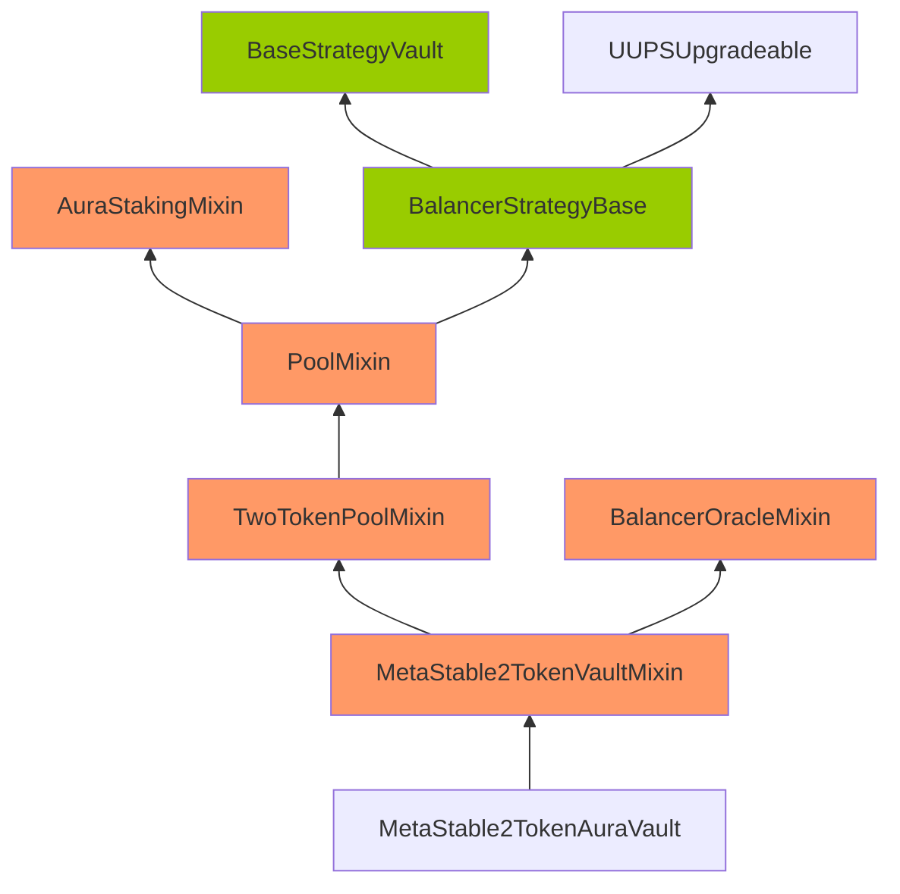

# Storage Gap Security Patterns

## Overview

**Frequency**: 4 occurrences (0.01% of all findings)

**Severity Distribution**:
| Critical | High | Medium | Low | Gas |
|----------|------|--------|-----|-----|
| 0 | 0 | 3 | 1 | 0 |

**Common Sources**: Sherlock, Cyfrin, Code4rena

---

## Detection Checklist

- [ ] Check for storage gap vulnerabilities in all external functions
- [ ] Verify proper validation and access controls
- [ ] Review state changes and their ordering
- [ ] Analyze edge cases and boundary conditions
- [ ] Test with malicious inputs and sequences

---

## Real-World Examples

### Example 1: [M-07] No Storage Gap for Upgradeable Contracts

**Source**: Code4rena
**Protocol**: Rubicon
**Impact**: MEDIUM

**Details**:

_Submitted by 0x1337, also found by broccolirob_

<https://github.com/code-423n4/2022-05-rubicon/blob/8c312a63a91193c6a192a9aab44ff980fbfd7741/contracts/RubiconMarket.sol#L448-L449>

<https://github.com/code-423n4/2022-05-rubicon/blob/8c312a63a91193c6a192a9aab44ff980fbfd7741/contracts/RubiconMarket.sol#L525-L535>

### Impact

For upgradeable contracts, there must be storage gap to "allow developers to freely add new state variables in the future without compromising the storage compatibility with existing deployments". Otherwise it may be very difficult to write new implementation code. Without storage gap, the variable in child contract might be overwritten by the upgraded base contract if new variables are added to the base contract. This could have unintended and very serious consequences to the child contracts.

Refer to the bottom part of this article: <https://docs.openzeppelin.com/upgrades-plugins/1.x/writing-upgradeable>

### Proof of Concept

As an example, the `ExpiringMarket` contract inherits `SimpleMarket`, and the `SimpleMarket` contract does not contain any storage gap. If in a future upgrade, an additional variable is added to the `SimpleMarket` contract, that new variable will overwrite the storage slot of the `stopped` variable in the `ExpiringMarket` contract, causing unintended consequences.

<https://github.com/code-423n4/2022-05-rubicon/blob/8c312a63a91193c6a192a9aab44ff980fbfd7741/contracts/RubiconMarket.sol#L448-L449>

Similarly, the `ExpiringMarket` d

*[Content truncated...]*

**Reference**: [View Original Finding](https://code4rena.com/reports/2022-05-rubicon)

---

### Example 2: M-16: Corruptible Upgradability Pattern

**Source**: Sherlock
**Protocol**: Notional
**Impact**: MEDIUM

**Details**:

Source: https://github.com/sherlock-audit/2022-09-notional-judging/issues/64 

## Found by 
xiaoming90, supernova

## Summary

Storage of Boosted3TokenAuraVault and MetaStable2TokenAuraVault vaults might be corrupted during an upgrade.

## Vulnerability Detail

Following are the inheritance of the Boosted3TokenAuraVault and MetaStable2TokenAuraVault vaults.

Note: The contracts highlighted in Orange mean that there are no gap slots defined. The contracts highlighted in Green mean that gap slots have been defined

**Inheritance of the MetaStable2TokenAuraVault vault**




**Inheritance of the Boosted3TokenAuraVault vault**

```mermaid
graph BT;
	classDef nogap fill:#f96;
	classDef hasgap fill:#99cc00;
    Boosted3TokenAuraVault-->Boosted3TokenPoolMixin:::nogap
    Boosted3TokenPoolMixin:::nogap-->PoolMixin:::nogap
    PoolMixin:::nogap-->BalancerStrategyBase
    PoolMixin:::nogap-->AuraStakingMixin:::nogap
    BalancerStrategyBase:::hasgap--

*[Content truncated...]*

---

### Example 3: M-1: Lack of price freshness check in `ChainlinkOracle.sol#getPrice()` allows a stale price to be used

**Source**: Sherlock
**Protocol**: Sentiment
**Impact**: MEDIUM

**Details**:

Source: https://github.com/sherlock-audit/2022-08-sentiment-judging/tree/main/002-M 
## Found by 
defsec, icedpeachtea, oyc\_109, Lambda, 0xNineDec, Avci, ladboy233, JohnSmith, jonatascm, Ruhum, csanuragjain, PwnPatrol, WATCHPUG, 0xNazgul, xiaoming90, 0x52, 0xf15ers, ellahi, pashov, rbserver, GalloDaSballo, Chom, \_\_141345\_\_, cccz, devtooligan, Bahurum, HonorLt, GimelSec, Dravee, Olivierdem

## Summary

`ChainlinkOracle` should use the `updatedAt` value from the latestRoundData() function to make sure that the latest answer is recent enough to be used.

## Vulnerability Detail

In the current implementation of `ChainlinkOracle.sol#getPrice()`, there is no freshness check. This could lead to stale prices being used.

If the market price of the token drops very quickly ("flash crashes"), and Chainlink's feed does not get updated in time, the smart contract will continue to believe the token is worth more than the market value.

Chainlink also advise developers to check for the `updatedAt` before using the price:

> Your application should track the latestTimestamp variable or use the updatedAt value from the latestRoundData() function to make sure that the latest answer is recent enough for your application to use it. If your application detects that the reported answer is not updated within the heartbeat or within time limits that you determine are acceptable for your application, pause operation or switch to an alternate operation mode while identifying the cause of the de

*[Content truncated...]*

---

### Example 4: Upgradeable contracts which are inherited from should use ERC7201 namespaced storage layouts or storage gaps to prevent storage collision

**Source**: Cyfrin
**Protocol**: Strata
**Impact**: LOW

**Details**:

**Description:** The protocol has upgradeable contracts which other contracts inherit from. These contracts should either use:
* [ERC7201](https://eips.ethereum.org/EIPS/eip-7201) namespaced storage layouts - [example](https://github.com/OpenZeppelin/openzeppelin-contracts-upgradeable/blob/master/contracts/access/AccessControlUpgradeable.sol#L60-L72)
* storage gaps (though this is an [older and no longer preferred](https://blog.openzeppelin.com/introducing-openzeppelin-contracts-5.0#Namespaced) method)

The ideal mitigation is that all upgradeable contracts use ERC7201 namespaced storage layouts.

Without using one of the above two techniques storage collision can occur during upgrades.

**Strata:** Fixed in commit [98068bd](https://github.com/Strata-Money/contracts/commit/98068bd9d9d435b37ce8f855f45b61d37aa274db).

**Cyfrin:** Verified.

**Reference**: [View Original Finding](https://github.com/solodit/solodit_content/blob/main/reports/Cyfrin/2025-06-11-cyfrin-strata-v2.1.md)

---

## Statistics

- Total findings analyzed: 4
- Examples shown: 4
- Data source: Cyfrin Solodit (50,530 total findings)
- Last updated: 2026-01-29

