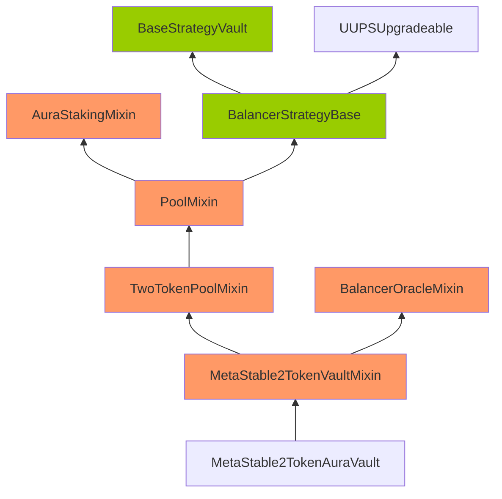
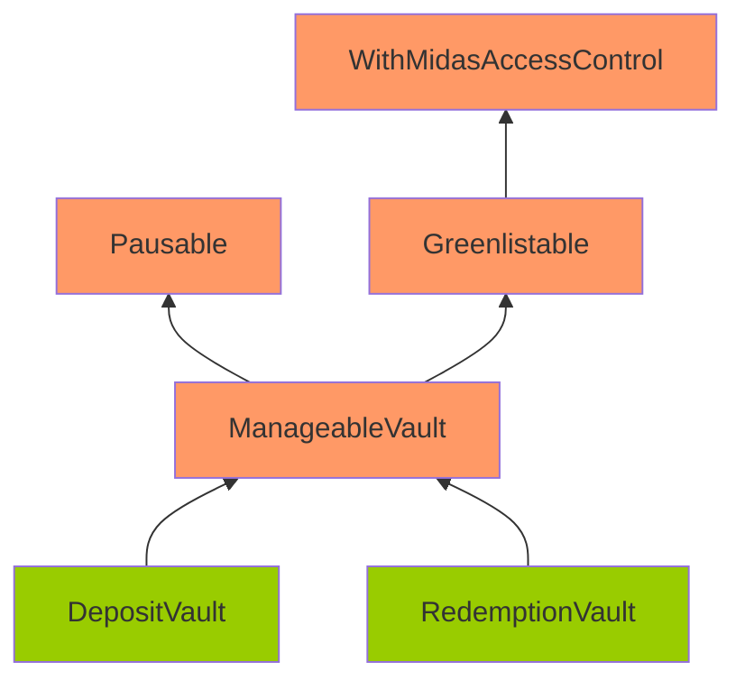
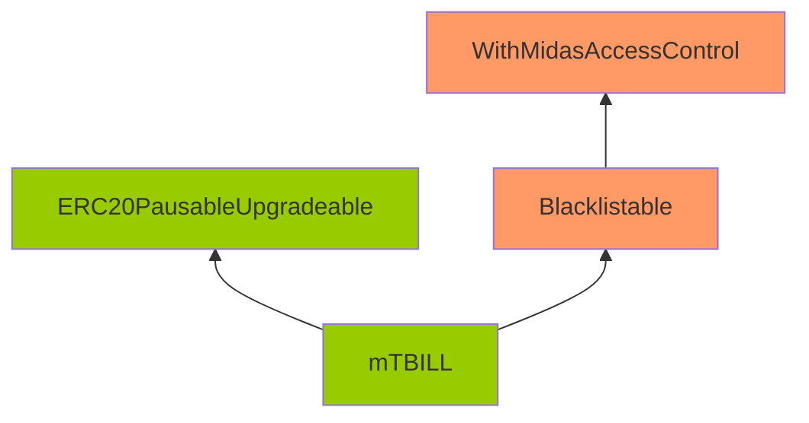

# Upgradable Security Patterns

## Overview

**Frequency**: 10 occurrences (0.02% of all findings)

**Severity Distribution**:
| Critical | High | Medium | Low | Gas |
|----------|------|--------|-----|-----|
| 0 | 2 | 6 | 2 | 0 |

**Common Sources**: Code4rena, Sherlock, Cyfrin

---

## Detection Checklist

- [ ] Check for upgradable vulnerabilities in all external functions
- [ ] Verify proper validation and access controls
- [ ] Review state changes and their ordering
- [ ] Analyze edge cases and boundary conditions
- [ ] Test with malicious inputs and sequences

---

## Real-World Examples

### Example 1: [H-01] Usage of an incorrect version of Ownbale library can potentially malfunction all onlyOwner functions

**Source**: Code4rena
**Protocol**: Covalent
**Impact**: HIGH

**Details**:

## Handle

WatchPug


## Vulnerability details

https://github.com/code-423n4/2021-10-covalent/blob/ded3aeb2476da553e8bb1fe43358b73334434737/contracts/DelegatedStaking.sol#L62-L63

```solidity
// this is used to have the contract upgradeable
function initialize(uint128 minStakedRequired) public initializer {
```

Based on the context and comments in the code, the `DelegatedStaking.sol` contract is designed to be deployed as an upgradeable proxy contract.

However, the current implementaion is using an non-upgradeable version of the `Ownbale` library: `@openzeppelin/contracts/access/Ownable.sol` instead of the upgradeable version: `@openzeppelin/contracts-upgradeable/access/OwnableUpgradeable.sol`.

A regular, non-upgradeable `Ownbale` library will make the deployer the default owner in the constructor. Due to a requirement of the proxy-based upgradeability system, no constructors can be used in upgradeable contracts. Therefore, there will be no owner when the contract is deployed as a proxy contract.

As a result, all the `onlyOwner` functions will be inaccessible.

### Recommendation

Use `@openzeppelin/contracts-upgradeable/access/OwnableUpgradeable.sol` and `@openzeppelin/contracts-upgradeable/proxy/utils/Initializable.sol` instead.

And change the `initialize()` function to:

```solidity
function initialize(uint128 minStakedRequired) public initializer {
    __Ownable_init();
    ...
}
```

**Reference**: [View Original Finding](https://code4rena.com/reports/2021-10-covalent)

---

### Example 2: [H-04] The Constructor Caveat leads to bricking of Configurator contract.

**Source**: Code4rena
**Protocol**: Lybra Finance
**Impact**: HIGH

**Details**:

In Solidity, code that is inside a constructor or part of a global variable declaration is not part of a deployed contract's runtime bytecode. This code is executed only once, when the contract instance is deployed. As a consequence of this, the code within a logic contract's constructor will never be executed in the context of the proxy's state. This means that any state changes made in the constructor of a logic contract will not be reflected in the proxy's state.
1.  This will lead to governance timelocks contract and the `curvePool` contract contain default values of zero values.
2.  As a result, all the functions that rely on governance will be broken, since the governance address is set to zero address.

### Proof of Concept

```
// SPDX-License-Identifier: UNLICENSED
pragma solidity ^0.8.13;

import "forge-std/Test.sol";
import {ITransparentUpgradeableProxy} from "@openzeppelin/contracts/proxy/transparent/TransparentUpgradeableProxy.sol";

import {LybraProxy} from "@lybra/Proxy/LybraProxy.sol";
import {LybraProxyAdmin} from "@lybra/Proxy/LybraProxyAdmin.sol";
import {GovernanceTimelock} from "@lybra/governance/GovernanceTimelock.sol";
import {PeUSDMainnet} from "@lybra/token/PeUSDMainnetStableVision.sol";
import {Configurator} from "@lybra/configuration/LybraConfigurator.sol";
import {EUSDMock} from "@mocks/mockEUSD.sol";
import {mockCurve} from "@mocks/mockCurve.sol";
import {mockUSDC} from "@mocks/mockUSDC.sol";

/* remappings used
@lybra=contracts/lybra/
@mocks=cont

*[Content truncated...]*

**Reference**: [View Original Finding](https://code4rena.com/reports/2023-06-lybra)

---

### Example 3: [M-07] No Storage Gap for Upgradeable Contracts

**Source**: Code4rena
**Protocol**: Rubicon
**Impact**: MEDIUM

**Details**:

_Submitted by 0x1337, also found by broccolirob_

<https://github.com/code-423n4/2022-05-rubicon/blob/8c312a63a91193c6a192a9aab44ff980fbfd7741/contracts/RubiconMarket.sol#L448-L449>

<https://github.com/code-423n4/2022-05-rubicon/blob/8c312a63a91193c6a192a9aab44ff980fbfd7741/contracts/RubiconMarket.sol#L525-L535>

### Impact

For upgradeable contracts, there must be storage gap to "allow developers to freely add new state variables in the future without compromising the storage compatibility with existing deployments". Otherwise it may be very difficult to write new implementation code. Without storage gap, the variable in child contract might be overwritten by the upgraded base contract if new variables are added to the base contract. This could have unintended and very serious consequences to the child contracts.

Refer to the bottom part of this article: <https://docs.openzeppelin.com/upgrades-plugins/1.x/writing-upgradeable>

### Proof of Concept

As an example, the `ExpiringMarket` contract inherits `SimpleMarket`, and the `SimpleMarket` contract does not contain any storage gap. If in a future upgrade, an additional variable is added to the `SimpleMarket` contract, that new variable will overwrite the storage slot of the `stopped` variable in the `ExpiringMarket` contract, causing unintended consequences.

<https://github.com/code-423n4/2022-05-rubicon/blob/8c312a63a91193c6a192a9aab44ff980fbfd7741/contracts/RubiconMarket.sol#L448-L449>

Similarly, the `ExpiringMarket` d

*[Content truncated...]*

**Reference**: [View Original Finding](https://code4rena.com/reports/2022-05-rubicon)

---

### Example 4: M-16: Corruptible Upgradability Pattern

**Source**: Sherlock
**Protocol**: Notional
**Impact**: MEDIUM

**Details**:

Source: https://github.com/sherlock-audit/2022-09-notional-judging/issues/64 

## Found by 
xiaoming90, supernova

## Summary

Storage of Boosted3TokenAuraVault and MetaStable2TokenAuraVault vaults might be corrupted during an upgrade.

## Vulnerability Detail

Following are the inheritance of the Boosted3TokenAuraVault and MetaStable2TokenAuraVault vaults.

Note: The contracts highlighted in Orange mean that there are no gap slots defined. The contracts highlighted in Green mean that gap slots have been defined

**Inheritance of the MetaStable2TokenAuraVault vault**




**Inheritance of the Boosted3TokenAuraVault vault**

```mermaid
graph BT;
	classDef nogap fill:#f96;
	classDef hasgap fill:#99cc00;
    Boosted3TokenAuraVault-->Boosted3TokenPoolMixin:::nogap
    Boosted3TokenPoolMixin:::nogap-->PoolMixin:::nogap
    PoolMixin:::nogap-->BalancerStrategyBase
    PoolMixin:::nogap-->AuraStakingMixin:::nogap
    BalancerStrategyBase:::hasgap--

*[Content truncated...]*

---

### Example 5: M-15: `CrossCurrencyfCashVault` Cannot Be Upgraded

**Source**: Sherlock
**Protocol**: Notional
**Impact**: MEDIUM

**Details**:

Source: https://github.com/sherlock-audit/2022-09-notional-judging/issues/65 

## Found by 
xiaoming90

## Summary

`CrossCurrencyfCashVault` cannot be upgraded as it is missing the authorize upgrade method.

## Vulnerability Detail

The Cross Currency Vault is expected to be upgradeable as:

- This vault is similar to the other vaults (Boosted3TokenAuraVault and MetaStable2TokenAuraVault) provided by Notional that are upgradeable by default.
- The `BaseStrategyVault` has configured the storage gaps `uint256[45] private __gap` for upgrading purposes
- Clarified with the sponsor and noted that Cross Currency Vault should be upgradeable

`CrossCurrencyfCashVault` inherits from `BaseStrategyVault`.  However, the `BaseStrategyVault` forget to inherit Openzepplin's `UUPSUpgradeable` contract. Therefore, it is missing the authorize upgrade method, and the contract cannot be upgraded.

https://github.com/sherlock-audit/2022-09-notional/blob/main/leveraged-vaults/contracts/vaults/BaseStrategyVault.sol#L14

```solidity
abstract contract BaseStrategyVault is Initializable, IStrategyVault {
    using TokenUtils for IERC20;
    using TradeHandler for Trade;

    /// @notice Hardcoded on the implementation contract during deployment
    NotionalProxy public immutable NOTIONAL;
    ITradingModule public immutable TRADING_MODULE;
    uint8 constant internal INTERNAL_TOKEN_DECIMALS = 8;
    
    ..SNIP..
    
    // Storage gap for future potential upgrades
    uint256[45] private __gap;
 }


*[Content truncated...]*

---

### Example 6: [M-04] Pool designed to be upgradeable but does not set owner, making it un-upgradeable

**Source**: Code4rena
**Protocol**: Blur Exchange
**Impact**: MEDIUM

**Details**:

The docs state:<br>
"*The pool allows user to predeposit ETH so that it can be used when a seller takes their bid. It uses an ERC1967 proxy pattern and only the exchange contract is permitted to make transfers.*"

Pool is designed as an ERC1967 upgradeable proxy which handles balances of users in Not Fungible. Users may interact via deposit and withdraw with the pool, and use the funds in it to pay for orders in the Exchange.

Pool is declared like so:
```
contract Pool is IPool, OwnableUpgradeable, UUPSUpgradeable {
	function _authorizeUpgrade(address) internal override onlyOwner {}
	...
```

Importantly, it has no constructor and no initializers. The issue is that when using upgradeable contracts, it is important to implement an initializer which will call the base contract's initializers in turn. See how this is done correctly in Exchange.sol:

```
/* Constructor (for ERC1967) */
function initialize(
		IExecutionDelegate _executionDelegate,
		IPolicyManager _policyManager,
		address _oracle,
		uint _blockRange
) external initializer {
		__Ownable_init();
		isOpen = 1;
		...
}
```

Since Pool skips the \_\_Ownable_init initialization call, this logic is skipped:
```
function __Ownable_init() internal onlyInitializing {
		__Ownable_init_unchained();
}
function __Ownable_init_unchained() internal onlyInitializing {
		_transferOwnership(_msgSender());
}
```

Therefore, the contract owner stays zero initialized, and this means any use of onlyOwner will always revert.

The only 

*[Content truncated...]*

**Reference**: [View Original Finding](https://code4rena.com/reports/2022-11-non-fungible)

---

### Example 7: [M-21] Truncation in casting can lead to a founder receiving all the base tokens

**Source**: Code4rena
**Protocol**: Nouns Builder
**Impact**: MEDIUM

**Details**:

<https://github.com/code-423n4/2022-09-nouns-builder/blob/7e9fddbbacdd7d7812e912a369cfd862ee67dc03/src/token/Token.sol#L71-L126><br>
<https://github.com/code-423n4/2022-09-nouns-builder/blob/7e9fddbbacdd7d7812e912a369cfd862ee67dc03/src/token/Token.sol#L88>

The initialize function of the `Token` contract receives an array of `FounderParams`, which contains the ownership percent of each founder as a `uint256`. The initialize function checks that the sum of the percents is not more than 100, but the value that is added to the sum of the percent is truncated to fit in `uint8`. This leads to an error because the value that is used for assigning the base tokens is the original, not truncated, `uint256` value.

This can lead to wrong assignment of the base tokens, and can also lead to a situation where not all the users will get the correct share of base tokens (if any).

### Proof of Concept

To verify this bug I created a foundry test. You can add it to the test folder and run it with `forge test --match-test testFounderGettingAllBaseTokensBug`.

This test deploys a token implementation and an `ERC1967` proxy that points to it, and initializes the proxy using an array of 2 founders, each having 256 ownership percent. The value which is added to the `totalOwnership` variable is a `uint8`, and when truncating 256 to fit in a `uint8` it will turn to 0, so this check will pass.

After the call to initialize, the test asserts that all the base token ids belongs to the first founder, w

*[Content truncated...]*

**Reference**: [View Original Finding](https://code4rena.com/reports/2022-09-nouns-builder)

---

### Example 8: M-1: Corruptible Upgradability Pattern

**Source**: Sherlock
**Protocol**: Midas
**Impact**: MEDIUM

**Details**:

Source: https://github.com/sherlock-audit/2024-05-midas-judging/issues/109 

## Found by 
0xb0k0, 0xjarix, Kalogerone, PNS, ZdravkoHr., charles\_\_cheerful, meltedblocks, nfmelendez, pkqs90, tpiliposian, yovchev\_yoan

## Summary

Storage of DepositVault/RedemptionVault/mTBILL contracts might be corrupted during an upgrade.

## Vulnerability Detail

Following are the inheritance of the DepositVault/RedemptionVault/mTBILL contracts.

Note: The contracts highlighted in Orange mean that there are no gap slots defined. The contracts highlighted in Green mean that gap slots have been defined





The DepositVault/RedemptionVault/mTBILL contracts are meant to be upgradeable. However, it inherits contracts that are not upgrade-safe.

The gap storage has been implemented on the DepositVault/RedemptionVault/mTBILL/ERC20PausableUpgradeable.

However, no gap storage is implemented on ManageableVaul

*[Content truncated...]*

---

### Example 9: [L-03] Contracts are not using their OZ upgradeable counterparts

**Source**: Code4rena
**Protocol**: JPYC
**Impact**: LOW

**Details**:

### Tools Used

Diffchecker

### Description

The non-upgradeable standard version of OpenZeppelin’s library, such as `Ownable`, `Pausable`, `Address`, `Context`, `SafeERC20`, `ERC1967Upgrade` etc, are inherited / used by both the proxy and the implementation contracts.

As a result, when attempting to use the upgrades plugin mentioned, the following errors are raised:

```solidity
Error: Contract `FiatTokenV1` is not upgrade safe

contracts/v1/FiatTokenV1.sol:58: Variable `totalSupply_` is assigned an initial value
  Move the assignment to the initializer
  https://zpl.in/upgrades/error-004

contracts/v1/Pausable.sol:49: Variable `paused` is assigned an initial value
  Move the assignment to the initializer
  https://zpl.in/upgrades/error-004

contracts/v1/Ownable.sol:28: Contract `Ownable` has a constructor
  Define an initializer instead
  https://zpl.in/upgrades/error-001

contracts/util/Address.sol:186: Use of delegatecall is not allowed
  https://zpl.in/upgrades/error-002
```

Having reviewed these errors, none had any adversarial impact:

*   `totalSupply_` and `paused` are explictly assigned the default values `0` and `false`
*   the implementation contracts utilises the internal `_transferOwnership()` in the initializer, thus transferring ownership to `newOwner` regardless of who the current owner is
*   `Address`'s `delegatecall` is only used by the `ERC1967Upgrade` contract. Comparing both the `Address` and `ERC1967Upgrade` contracts against their upgradeable count

*[Content truncated...]*

**Reference**: [View Original Finding](https://code4rena.com/reports/2022-02-jpyc)

---

### Example 10: Upgradeable contracts which are inherited from should use ERC7201 namespaced storage layouts or storage gaps to prevent storage collision

**Source**: Cyfrin
**Protocol**: Strata
**Impact**: LOW

**Details**:

**Description:** The protocol has upgradeable contracts which other contracts inherit from. These contracts should either use:
* [ERC7201](https://eips.ethereum.org/EIPS/eip-7201) namespaced storage layouts - [example](https://github.com/OpenZeppelin/openzeppelin-contracts-upgradeable/blob/master/contracts/access/AccessControlUpgradeable.sol#L60-L72)
* storage gaps (though this is an [older and no longer preferred](https://blog.openzeppelin.com/introducing-openzeppelin-contracts-5.0#Namespaced) method)

The ideal mitigation is that all upgradeable contracts use ERC7201 namespaced storage layouts.

Without using one of the above two techniques storage collision can occur during upgrades.

**Strata:** Fixed in commit [98068bd](https://github.com/Strata-Money/contracts/commit/98068bd9d9d435b37ce8f855f45b61d37aa274db).

**Cyfrin:** Verified.

**Reference**: [View Original Finding](https://github.com/solodit/solodit_content/blob/main/reports/Cyfrin/2025-06-11-cyfrin-strata-v2.1.md)

---

## Statistics

- Total findings analyzed: 10
- Examples shown: 10
- Data source: Cyfrin Solodit (50,530 total findings)
- Last updated: 2026-01-29
